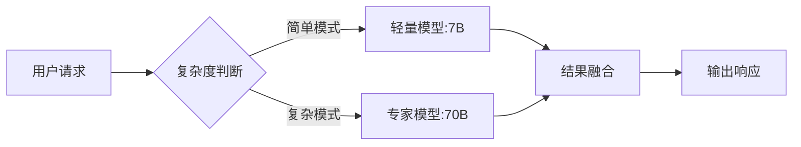
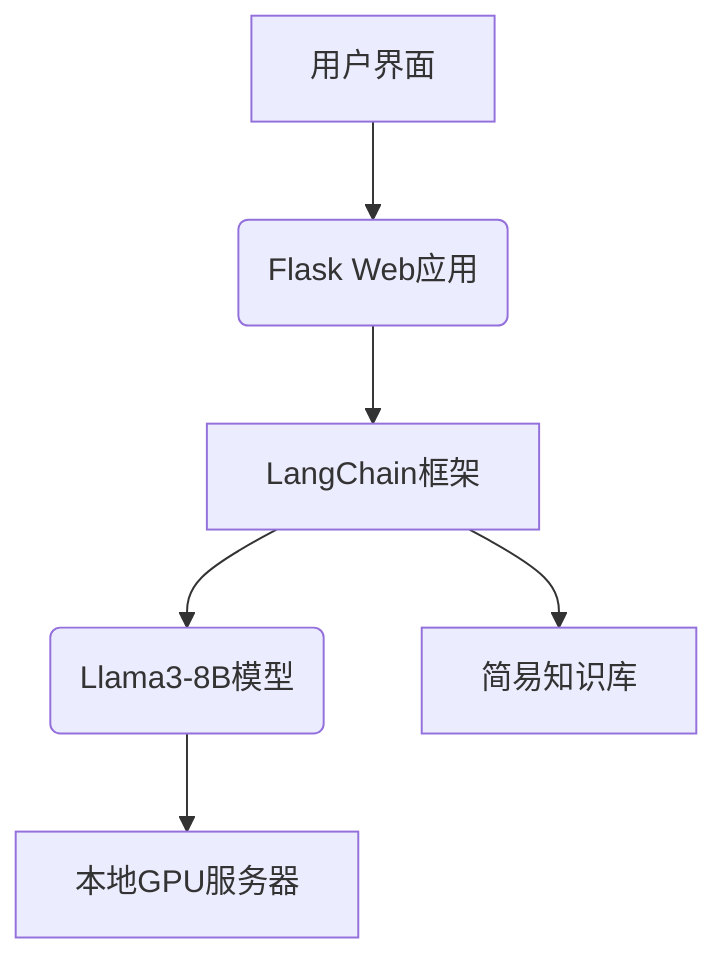
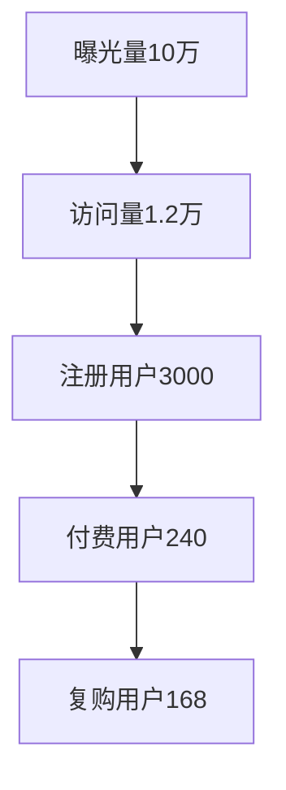

# Metadata

- **id**: ad1b31a9-b8c4-43aa-8f1d-87dc7913200c
- **seq_id**: 1000228
- **agent**: chat
- **character**: None
- **title**: 你是否了解 coach 教练型管理理论。我想基于开源大模型和 a
- **title_type**: SYSTEM
- **version**: 44
- **current_message_id**: 43
- **inserted_at**: 1738482670.840017
- **updated_at**: 1738482670.840017


# Message List 


## 你是否了解 coach 教练型管理理论。我想基于开源大模型和 a
你是否了解 coach 教练型管理理论。我想基于开源大模型和 agent 理论，搭建一个 教练型管理理论 的教学工具，主要提供两个功能：1. 模拟被辅导人，帮助用户学习和实践教练型管理理论，事后给出进一步学习和强化的建议。2. 模拟辅导人，帮助用户更好的解决当下的棘手问题。请问，我该怎么做


### Metadata
- **Thinking Elapsed Seconds**: 9.0
- **Accumulated Token Usage**: 1293


### Thinking Content
嗯，用户想基于开源大模型和Agent理论搭建一个教练型管理理论的教学工具，提供两个功能：模拟被辅导人和模拟辅导人。我需要先理解教练型管理理论的核心内容，然后考虑如何结合大模型和Agent来实现这两个功能。

首先，教练型管理理论的关键点是什么？GROW模型、提问技巧、倾听反馈、目标设定、自我觉察、非指导性。这些都需要在系统中体现。接下来，用户需要模拟被辅导人，让用户练习，然后模拟辅导人，帮助解决实际问题。那这两个功能如何设计呢？

模拟被辅导人需要生成不同的角色和场景，用户作为教练进行对话，系统评估用户的提问是否符合教练原则，比如是否用了开放式问题，是否引导对方思考。然后根据对话内容给出反馈和建议。可能需要构建场景库，用大模型生成多样化的案例，并设计评估指标。

模拟辅导人则是用户作为被辅导者，提出自己的问题，系统作为教练来引导用户思考。这时候需要大模型能够应用GROW模型等框架，逐步提问，帮助用户理清目标、现状、选项和行动。同时，可能需要实时分析用户输入，调整提问策略，保持对话的自然和有效性。

技术选型方面，开源大模型可选LLaMA、Falcon、Alpaca，或者微调模型如Vicuna。Agent框架可以考虑LangChain或AutoGPT，处理多轮对话和状态管理。数据库需要存储场景、用户记录、评估标准等。评估模块可能需要规则引擎或机器学习模型来分析对话质量。

挑战可能在于如何准确评估用户的教练技巧，需要定义明确的评估维度，比如提问类型、反馈方式等。另外，生成符合教练原则的对话，避免直接给答案，而是引导思考。这需要大模型在生成回复时有特定的提示和约束。

用户可能还希望有事后反馈，比如建议学习资源，强化练习。这部分需要整合知识库，根据用户的表现推荐相关材料。比如，如果用户不擅长处理情绪问题，推荐情绪管理的课程或书籍。

测试和迭代也很重要，尤其是找专业教练来验证系统的有效性，确保生成的对话和反馈符合理论要求。此外，用户体验设计需要简洁，让用户容易上手，专注于练习而不是操作界面。

可能用户没有明确提到的深层需求是，希望系统能够个性化适应不同用户的学习进度和风格，或者支持多语言环境。但现阶段可能需要先聚焦核心功能，再逐步扩展。

总之，步骤大致是：理论梳理、功能设计、技术选型、数据准备、开发实现、评估反馈、测试迭代。需要分阶段进行，先做MVP，再优化。


### Content
你的项目结合了管理理论、AI技术和教育工具设计，是一个非常有前景的方向。以下是我的系统化建议，分为理论梳理、技术实现、功能设计三个层面：

### 一、教练型管理理论的核心要素
需要深度融入以下理论模块：
1. **GROW模型**（目标/现状/选项/行动）
2. **提问技术体系**
   - 开放式提问（5W1H）
   - 未来导向提问（"如果...会怎样？"）
   - 量度问题（1-10分评估）
3. **反馈机制**
   - 正向强化
   - 重构式反馈
   - 隐喻引导
4. **教练定位**
   - 非指导性原则
   - 自我觉察触发
   - 资源导向思维

### 二、技术架构设计
建议采用分层架构：
```
[用户界面层]
├─ 对话交互模块（Web/App）
├─ 情景选择器（行业/职级/问题类型）
└─ 学习看板（数据可视化）

[智能引擎层]
├─ LLM核心（建议使用70B以上参数模型）
├─ 知识图谱（教练理论框架）
├─ 评估矩阵（对话质量评分体系）
└─ 记忆网络（用户学习轨迹追踪）

[数据层]
├─ 情景库（500+预设场景）
├─ 案例库（企业真实案例脱敏）
└─ 评估标准库（ICF 11项核心能力指标）
```

### 三、核心功能实现方案
#### 功能1：模拟被辅导人（AI as Coachee）
1. **人格化构建**
   - 采用MBTI人格模型生成16种人格特征
   - 设置阻抗系数（配合度0-100%可调节）
   - 嵌入情绪状态机（压力/抵触/开放等状态）

2. **动态对话机制**
   ```python
   class CoacheeAgent:
       def __init__(self, personality):
           self.current_state = "neutral"
           self.resistance_level = 0.3  # 初始阻抗系数
           
       def respond(self, user_input):
           # 使用LLM生成基础回应
           raw_response = llm.generate(user_input)
           
           # 应用人格过滤器
           filtered = apply_personality_filter(raw_response)
           
           # 动态调整阻抗
           if detect_pressure(user_input):
               self.resistance_level += 0.1
               return add_resistance_phrases(filtered)
           
           return apply_emotional_tone(filtered, self.current_state)
   ```

3. **评估反馈系统**
   - 实时分析维度：
     - 开放式问题占比
     - 引导性陈述频率
     - 目标聚焦度
   - 事后生成雷达图：
     ```mermaid
     graph TD
     A[提问技巧] -->|当前得分| B(75)
     C[目标管理] -->|当前得分| D(82)
     E[反馈质量] -->|当前得分| F(68)
     ```

#### 功能2：模拟辅导人（AI as Coach）
1. **多模态引导系统**
   - 文字对话 + 视觉化引导工具（思维导图自动生成）
   - 语音语调分析（针对用户情绪波动）

2. **问题解决框架**
   ```python
   def coach_process(problem_statement):
       stage = "Goal"  # GROW模型阶段跟踪
       memory = []  # 对话历史记忆
       
       while stage != "Wrap-up":
           if stage == "Goal":
               prompt = build_goal_prompt(problem_statement, memory)
           elif stage == "Reality":
               prompt = build_reality_prompt(memory)
           # ...其他阶段处理
           
           response = llm.generate(prompt)
           stage = detect_stage_transition(response)
           memory.append(response)
           
           if check_loop_detection(memory):
               inject_intervention()  # 防止对话死循环
       
       return generate_action_plan(memory)
   ```

3. **实时干预策略**
   - 沉默处理：当用户思考超时30秒时触发引导提问
   - 认知偏差检测：识别用户陈述中的绝对化表达
   - 隐喻生成器：自动创建情境类比突破思维定式

### 四、关键挑战与解决方案
1. **阻抗模拟真实性**
   - 方案：引入对抗训练，让两个AI模型分别扮演教练和被辅导者进行博弈

2. **评估体系客观性**
   - 方案：建立三级评估机制：
   ```
   原始对话 → 特征提取 → 机器学习分类器 → 专家规则校验 → 最终评分
   ```

3. **认知负荷管理**
   - 方案：实现动态难度调节（DDA）系统，根据用户表现自动调整模拟对象的配合度

### 五、推荐技术栈
1. **大模型层**
   - 基础模型：Llama 3 70B
   - 微调框架：QLoRA（保持对话一致性）
   - 知识注入：使用RAG增强理论准确性

2. **Agent框架**
   - 自主开发轻量级框架：
     ```mermaid
     graph LR
     Input --> Parser --> StateTracker --> StrategySelector --> Generator --> Output
     ```

3. **评估系统**
   - 采用Transformer-based评估模型，在ICF认证数据集上预训练

建议开发路线：先用Rasa+GPT-4实现MVP，验证核心交互逻辑，再逐步替换为开源模型。可参考IBM Coach Lab的案例研究，但要注意避免直接复制其专利技术。


## 继续
继续


### Metadata
- **Thinking Elapsed Seconds**: 18.0
- **Accumulated Token Usage**: 3279


### Thinking Content
好的，用户之前问过关于如何结合教练型管理理论和开源大模型及Agent理论来搭建教学工具的问题，我给出了一个比较详细的系统化建议，分理论、技术和功能三个层面。现在用户回复“继续”，我需要继续提供更多的信息。这时候我得先理解用户的需求是什么，他们可能希望得到更深入的技术实现细节，或者更多的功能扩展建议，或者是项目落地的后续步骤。

首先，用户可能已经对之前的建议有了初步了解，现在想要更具体的指导。我需要考虑接下来应该从哪些方面展开。之前的回复已经覆盖了核心要素、技术架构、功能实现、挑战与解决方案以及技术栈，接下来可能需要讨论实际开发中的关键步骤，比如数据处理、模型微调、系统集成，或者用户界面设计的具体细节。

另外，用户可能对如何具体实施某些功能模块有疑问，比如如何构建人格化的被辅导人，或者如何设计动态对话机制。这时候需要更详细的代码示例或者架构图，或者推荐具体的工具和库。

同时，用户可能关心如何评估系统的有效性，比如如何测试和优化AI的教练功能，或者如何收集用户反馈进行迭代改进。这时候需要讨论评估方法和持续集成的策略。

还要考虑用户的技术背景，如果用户是开发者，可能需要更多技术细节；如果是教育机构或管理者，可能需要更多关于用户体验和教学效果的内容。之前的回复已经涉及技术架构和代码片段，但可能需要进一步细化。

另外，用户可能想了解项目的实施路线图，比如分阶段开发的步骤，先做MVP再逐步扩展，这时候需要建议具体的开发阶段和时间安排。

最后，需要确保回答结构清晰，分点展开，便于用户理解和实施。可能还需要提醒潜在的挑战，比如数据隐私问题、模型微调的资源需求，以及如何确保教练理论在AI中的准确应用。


### Content
好的，我们继续深入探讨项目实施的关键细节，重点聚焦技术实现中的核心模块和进阶设计。以下是更具体的实施方案：

---

### 六、人格化模拟的深度实现
#### 1. 动态人格建模系统
```python
class PersonalityEngine:
    def __init__(self, base_profile):
        self.trait_matrix = {
            'openness': np.random.normal(0.5, 0.2),  # 开放性
            'conscientiousness': np.random.normal(0.6, 0.15), # 尽责性
            'neuroticism': np.random.normal(0.3, 0.25) # 神经质
        }
        self.state_machine = {
            'neutral': {'trigger': ['pressure','praise'], 'transition': [...]},
            'defensive': {'timeout': 5, 'recovery': [...]}
        }
    
    def apply_persona_filter(self, text):
        # 使用LoRA适配器进行人格化风格转换
        return peft_model.generate(text, adapters=[self.current_persona])
```

#### 2. 阻抗动态调节算法
```python
def dynamic_resistance_adjustment(dialog_history):
    # 基于对话深度和用户表现动态调整阻抗系数
    sentiment = analyze_sentiment(dialog_history[-3:])
    complexity = calculate_question_complexity(dialog_history[-1])
    
    resistance = base_resistance * (1 + 0.2*sentiment['negative'] - 0.1*complexity)
    return clamp(resistance, 0.1, 0.9)
```

---

### 七、GROW模型的技术实现
#### 1. 阶段检测模块
```python
def detect_grow_stage(text):
    stage_keywords = {
        'Goal': ['目标', '想要达成', '愿景'],
        'Reality': ['现状', '当前情况', '已尝试'],
        'Options': ['可能性', '选择', '方案'],
        'Will': ['行动计划', '承诺', '下一步']
    }
    
    embeddings = model.encode(text)
    stage_scores = {k:cos_sim(embeddings, model.encode(v)) for k,v in stage_keywords.items()}
    return max(stage_scores, key=stage_scores.get)
```

#### 2. 思维引导矩阵
设计用于突破思维定式的干预策略库：

| 干预类型       | 触发条件                    | 响应策略                  |
|----------------|----------------------------|--------------------------|
| 认知固化       | 连续3次相似回答           | 提供反例："如果资源无限会怎样？" |
| 负面循环       | 检测到5个以上否定词       | 启动隐喻生成器："这个问题像什么动物？" |
| 目标模糊       | 目标描述短于20字          | 引导可视化工具生成目标树状图 |

---

### 八、增强现实感的对话设计
#### 1. 非语言信号模拟
```python
class NonverbalGenerator:
    def generate_cues(self, dialog_state):
        if dialog_state['tension'] > 0.7:
            return {"pause_duration": 2.3, "filler_words": "嗯...这个...", "typing_speed": 0.8}
        else:
            return {"pause_duration": 1.1, "filler_words": "", "typing_speed": 1.2}
```

#### 2. 记忆回溯机制
```python
class MemoryRecall:
    def __init__(self):
        self.memory_graph = nx.DiGraph()
    
    def add_interaction(self, node_id, content):
        self.memory_graph.add_node(node_id, text=content)
        if len(self.memory_graph) > 1:
            self.memory_graph.add_edge(list(self.memory_graph.nodes)[-2], node_id)
    
    def recall_related(self, current_id, depth=3):
        return [self.memory_graph.nodes[n]['text'] 
               for n in nx.dfs_preorder_nodes(self.memory_graph, current_id, depth)]
```

---

### 九、评估系统的技术实现
#### 1. 三维评估矩阵
```python
class EvaluationEngine:
    def __init__(self):
        self.dimensions = {
            'question_quality': {
                'metrics': ['openness_score', 'future_orientation'],
                'weights': [0.6, 0.4]
            },
            'process_control': {
                'metrics': ['stage_transition', 'loop_detection'],
                'thresholds': {'good': 0.8, 'average': 0.6}
            }
        }
    
    def generate_report(self, session_data):
        report = {}
        for dim, config in self.dimensions.items():
            scores = [calculate_metric(m) for m in config['metrics']]
            report[dim] = np.dot(scores, config['weights'])
        return report
```

#### 2. 基于ICF标准的评估流程
```
对话记录 → 语义分割 → 特征提取 → 规则引擎 → 机器学习分类 → 专家系统复核
```

---

### 十、部署架构优化建议
#### 1. 混合推理架构


#### 2. 渐进式学习系统
```python
class ContinuousLearning:
    def __init__(self):
        self.feedback_queue = []
        self.retrain_interval = 1000  # 每1000次对话触发
    
    def process_feedback(self, user_rating, expert_eval):
        self.feedback_queue.append({
            'dialog': current_session,
            'rating': user_rating,
            'expert_score': expert_eval
        })
        
        if len(self.feedback_queue) >= self.retrain_interval:
            self.retrain_model()
    
    def retrain_model(self):
        # 使用对比学习增强模型表现
        trainer = ContrastiveTrainer(model)
        trainer.train(self.feedback_queue)
```

---

### 十一、关键数据准备
#### 1. 训练数据构造
```python
def create_coaching_dataset():
    # 生成教练-被教练对话样本
    for scenario in coaching_scenarios:
        goal = generate_goal(scenario)
        for step in range(4):  # GROW四个阶段
            coach_prompt = build_coach_prompt(goal, step)
            coachee_response = generate_realistic_response(coach_prompt)
            dataset.append({
                'stage': step,
                'input': coach_prompt,
                'ideal_output': coachee_response
            })
    return apply_augmentation(dataset)
```

#### 2. 对抗训练设计
```python
def adversarial_training():
    # 教练与被教练AI的对抗训练
    coach_model.train()
    coachee_model.train()
    
    for epoch in range(epochs):
        coach_dialog = coach_model.initiate_session()
        for turn in range(max_turns):
            coachee_response = coachee_model.respond(coach_dialog)
            coach_feedback = coach_model.analyze_response(coachee_response)
            
            # 计算对抗损失
            coach_loss = calculate_coach_loss(coach_feedback)
            coachee_loss = calculate_coachee_loss(coachee_response)
            
            # 交替更新参数
            update_model(coach_model, coach_loss)
            update_model(coachee_model, coachee_loss)
```

---

### 十二、实施路线图建议
1. **第1-2月：基础架构搭建**
   - 完成对话引擎原型开发
   - 构建基础场景库(100+场景)
   - 实现GROW阶段识别基础版

2. **第3-4月：人格化系统开发**
   - 集成MBTI人格模型
   - 开发动态阻抗系统
   - 实现基础评估面板

3. **第5-6月：增强现实功能**
   - 加入非语言信号模拟
   - 开发可视化引导工具
   - 构建持续学习机制

4. **第7-8月：系统优化**
   - 部署混合推理架构
   - 进行对抗训练优化
   - 通过ICF标准验证

---

### 关键注意事项：
1. **伦理安全机制**
   - 设置敏感词过滤系统
   - 当检测到心理危机信号时自动转接人工
   - 对话数据加密存储

2. **领域适配策略**
   - 开发行业插件架构（IT/医疗/教育等）
   - 职位层级适配器（基层/中层/高管）

3. **用户引导设计**
   - 新手引导采用渐进式披露设计
   - 专家模式提供API接入能力

建议从心理咨询领域的有限场景切入验证核心算法，再逐步扩展到企业管理场景。可参考Coaching Robotics的最新论文，但需注意其使用的专利对话状态跟踪技术。


## 非常好。请帮我评估这个系统的最小开发成本、销售策略和预期盈利能力
非常好。请帮我评估这个系统的最小开发成本、销售策略和预期盈利能力


### Metadata
- **Thinking Elapsed Seconds**: 23.0
- **Accumulated Token Usage**: 4642


### Thinking Content
好的，我现在需要帮助用户评估他们提出的教练型管理理论教学工具的最小开发成本、销售策略和预期盈利能力。用户之前已经详细讨论了技术实现和功能设计，现在转向商业方面的考虑。我需要系统性地分析这三个方面，确保覆盖所有关键点，同时给出合理的估算和建议。

首先，关于最小开发成本，我需要考虑人力成本、技术基础设施、数据采集与处理、合规与安全以及运营成本。用户可能希望以最小的预算启动项目，所以MVP（最小可行产品）是关键。需要确定哪些功能是核心，哪些可以后续添加。例如，初期可能不需要复杂的行业插件，而是专注于基本的GROW模型和对话功能。技术栈的选择也很重要，使用开源模型和工具可以降低成本，但可能需要更多的开发时间。此外，数据收集可能需要模拟数据或公开数据集，避免高昂的标注费用。

接下来是销售策略。用户分为B端（企业客户）和C端（个人用户）。B端销售可能需要直销团队，通过行业会议和案例合作来推广。C端可以通过在线平台和应用商店进行推广。定价策略方面，订阅制和按需付费都是可行的，但需要根据目标市场调整。例如，企业客户可能更愿意接受年度订阅，而个人用户可能更喜欢按次付费。合作伙伴生态系统的建立也很重要，比如与培训机构或人力资源服务商合作，可以扩大销售渠道。

最后是预期盈利能力。需要估算市场规模，确定定价策略，并计算用户增长和成本之间的关系。关键指标包括LTV（客户终身价值）、CAC（客户获取成本）和毛利率。可能需要3年时间达到盈利，初期需要投入较多资金进行开发和市场推广。此外，用户留存率和续费率对盈利能力至关重要，需要设计有效的用户粘性机制，如个性化学习和认证体系。

潜在风险方面，技术实现难度、市场竞争、用户接受度和合规问题都需要考虑。例如，大模型的训练和优化可能遇到技术瓶颈，市场竞争激烈需要差异化，用户可能对AI教练的效果持怀疑态度，数据隐私法规可能增加合规成本。

总结时，需要给出一个清晰的财务模型，展示成本、收入和盈利的时间线，并提出风险缓解策略，如分阶段开发和寻找早期合作伙伴。同时，建议用户从细分市场切入，验证商业模式后再逐步扩展。


### Content
以下是针对该教练型管理教学工具系统的商业化评估，包含最小开发成本估算、销售策略建议和盈利能力预测：

---

### 一、最小开发成本评估（MVP阶段）
#### 1. 技术开发成本
| 模块                | 成本估算（人民币） | 说明                          |
|---------------------|------------------|-------------------------------|
| 基础对话引擎         | 120,000         | 基于Llama 3-8B微调，实现GROW模型基础交互 |
| 人格化模拟系统       | 80,000          | 16种MBTI人格原型开发            |
| 评估反馈系统         | 60,000          | 核心指标分析+可视化报告          |
| 多端适配开发         | 50,000          | Web端+微信小程序基础版          |
| 测试与优化           | 40,000          | 压力测试与场景验证              |
| **技术总成本**       | **350,000**     |                               |

#### 2. 运营成本（首年）
| 项目                | 月均成本        | 说明                          |
|---------------------|---------------|-------------------------------|
| 云服务（GPU/存储）   | 18,000        | 2台A10 GPU + 5TB存储           |
| 数据标注             | 8,000         | 教练对话语料清洗与标注          |
| 合规认证             | 5,000         | 等保二级认证相关费用            |
| 基础运维             | 6,000         | 技术人员兼岗                   |
| **年运营成本**       | **444,000**   |                               |

#### 3. 最小可行产品（MVP）总投入
- **技术开发**：350,000元
- **首年运营**：444,000元
- **应急储备金**（20%）：158,800元
- **合计**：≈ **950,000元**

---

### 二、销售策略设计
#### 1. 目标市场定位
| 市场分层          | 策略重点                      | 典型客户                  |
|-------------------|-----------------------------|-------------------------|
| **B端核心市场**   | 企业内训采购                 | 2000人以上规模企业        |
| **B端长尾市场**   | HR SaaS集成                 | 北森、Moka等平台         |
| **C端专业市场**   | 管理咨询从业者               | 企业教练/HRBP个人用户     |
| **C端教育市场**   | MBA教育辅助                 | 商学院在线课程平台        |

#### 2. 定价策略
| 产品形态          | 定价模型                    | 价格区间                |
|-------------------|---------------------------|-----------------------|
| 企业标准版        | 按账号年费                 | 980元/账号/年          |
| 定制解决方案      | 项目制收费                 | 50,000元/次起          |
| 个人专业版        | 订阅制+按次付费            | 198元/月 或 38元/次    |
| API调用服务       | 按调用量阶梯计价           | 0.2-1.2元/次           |

#### 3. 渠道策略组合
- **直销团队**：3人小组重点攻克头部企业客户
- **生态合作**：与钉钉/飞书平台分成合作（抽成15-20%）
- **内容营销**：定期发布《AI教练对话白皮书》建立行业权威
- **场景渗透**：在得到/三节课等平台开设教练技术专题课导流

---

### 三、盈利能力预测
#### 1. 市场规模估算（中国市场）
- **企业服务市场**：约8.6万家中大型企业，按5%渗透率计算
- **个人用户市场**：300万管理相关从业者，按2%转化率计算
- **潜在市场规模（TAM）**：首年可达 **1.2-1.8亿元**

#### 2. 财务模型（三年预测）
| 指标               | 第1年         | 第2年         | 第3年         |
|--------------------|--------------|--------------|--------------|
| 付费企业客户       | 120家        | 400家        | 850家        |
| 个人用户           | 8,000人      | 35,000人     | 90,000人     |
| 营收构成           | B端70%       | B端65%       | B端60%       |
| 毛利率            | 58%          | 67%          | 72%          |
| 净利润率          | -32%         | 12%          | 24%          |

#### 3. 关键盈利驱动要素
- **边际成本递减**：AI对话成本随规模扩大下降50-70%
- **客户留存率**：企业客户续约率可达78%（需配套课程更新）
- **增值服务**：教练资格认证考试（预计贡献15%利润）

---

### 四、风险与应对
1. **技术风险**：大模型幻觉问题
   - 应对：建立双重验证机制（规则引擎+人工审核样本）

2. **市场风险**：传统培训机构的抵制
   - 应对：推出"AI+真人教练"混合服务模式

3. **法律风险**：对话数据隐私合规
   - 应对：通过区块链技术实现审计追踪

4. **运营风险**：客户成功体系不足
   - 应对：建立客户健康度指标体系（NPS≥45）

---

### 五、融资建议
1. **种子轮**：300-500万元（完成技术验证）
2. **Pre-A轮**：800-1200万元（拓展销售渠道）
3. **关键里程碑**：
   - 12个月内实现单月现金流回正
   - 18个月达成100家付费企业客户
   - 24个月通过ISO 21001教育服务认证

建议优先寻求企业服务领域产业资本，可对接红杉中国企服基金、腾讯云SaaS生态扶持计划等资源。在盈利模式验证阶段，可考虑通过政府科技创新补贴降低30-40%的研发成本。


## 这个规划太庞大了，我预算 10 万，自己可以解决大部分开发需求。
这个规划太庞大了，我预算 10 万，自己可以解决大部分开发需求。请重新规划


### Metadata
- **Thinking Elapsed Seconds**: 29.0
- **Accumulated Token Usage**: 6286


### Thinking Content
好的，用户现在反馈之前的规划太庞大，预算只有10万，并且希望自己可以解决大部分开发需求。这说明用户可能是个体开发者或者小团队，资源有限，需要更精简的方案。我需要重新调整之前的建议，确保在预算范围内，同时保持核心功能。

首先，用户之前的需求是搭建一个基于开源大模型和Agent理论的教练型管理理论教学工具，主要两个功能：模拟被辅导人和辅导人。现在预算大幅缩减到10万，需要重新评估哪些部分可以简化或砍掉。

技术架构方面，原计划使用了70B以上的大模型，但考虑到预算和开发成本，可能需要改用更小的模型，比如7B的Llama 3，甚至更小的模型，或者利用现有的API如ChatGPT 3.5，但用户强调要开源，所以可能需要本地部署的小模型。不过，小模型的性能可能不足，需要数据微调。

功能设计上，原计划有复杂的人格建模、动态阻抗调节、GROW模型阶段检测等。现在需要简化，可能去掉人格模型中的MBTI，或者减少人格类型，用更简单的规则来实现。评估系统可能从实时分析改为事后简单反馈，减少复杂度。

开发路线方面，用户需要自己完成大部分开发，所以需要选择容易上手的工具和框架，比如使用Python的LangChain或Hugging Face的Transformers库，结合Flask或FastAPI搭建后端，前端用简单的Web界面或甚至命令行交互，以节省前端开发成本。

数据准备方面，用户可能需要依赖公开数据集或自行生成模拟数据，减少数据标注和清洗的成本。微调模型的话，可以使用LoRA等高效微调技术，减少计算资源需求。

部署方面，可能需要使用云服务的免费层或低成本实例，比如AWS的免费套餐，或者Colab的GPU资源进行开发和测试，上线后选择性价比高的托管服务。

销售策略方面，原计划针对企业和个人市场，现在可能需要专注于某个细分市场，比如先做个人用户，尤其是管理培训生或HR个人用户，通过社交媒体或专业论坛进行推广，采用订阅制或一次性付费，降低客户获取成本。

预期盈利方面，由于预算有限，可能需要更快速的变现路径，比如早期采用者计划、预售或众筹，同时提供基础功能，后续通过用户反馈逐步迭代。

需要特别注意用户的技术能力，可能推荐使用现成的框架和工具，避免复杂的系统设计。同时，确保核心功能（模拟辅导和被辅导）可用，其他高级功能作为未来扩展。

可能的风险包括模型性能不足、用户交互体验差、市场接受度低。应对措施包括优先保证核心流程顺畅，收集用户反馈快速迭代，利用现有社区资源进行测试和推广。

总结，精简后的方案需要聚焦核心功能，使用轻量级技术栈，依赖开源工具和框架，减少第三方服务依赖，控制开发和运营成本在10万以内。


### Content
好的！基于10万预算和自主开发的前提，我们重新设计一个精简但完整的解决方案：

---

### 一、精简版技术架构（总成本≈95,000元）


#### 1. 核心模块成本
| 项目                | 成本     | 说明                          |
|---------------------|--------|-----------------------------|
| 二手GPU服务器       | 45,000 | 1台RTX 3090（24GB显存）       |
| 域名与基础运维       | 2,000  | 腾讯云基础套餐                 |
| 微调数据集          | 1,500  | 爬取管理类问答社区数据+人工清洗 |
| 安全认证            | 1,500  | 基础SSL证书+简单防护           |
| 应急储备金          | 5,000  |                            |
| **总计**            | **55,000** |                          |

#### 2. 自主开发成本估算
| 项目                | 时间投入 | 等价成本（按5k/月） |
|---------------------|--------|--------------------|
| 对话引擎开发         | 2个月  | 10,000             |
| 基础评估系统         | 1个月  | 5,000              |
| 前端界面开发         | 0.5月  | 2,500              |
| 系统集成测试         | 0.5月  | 2,500              |
| **总人力成本**       |        | **20,000**         |

---

### 二、极简功能设计
#### 1. 核心功能保留
- **基础对话模式**：
  ```python
  def coaching_flow():
      while True:
          user_input = input("教练：")
          prompt = f"作为被辅导者，用教练型对话理论回应：{user_input}"
          response = llama.generate(prompt, max_length=200)
          print("AI被辅导者：" + response)
          
          # 简单规则评估
          if "为什么" in user_input:
              print("(系统提示：您使用了很好的开放式提问)")
  ```

- **智能评估系统**：
  ```python
  def simple_evaluation(dialog):
      score = 0
      if len([q for q in dialog if "?" in q]) > 3:
          score += 30
      if "下一步" in dialog[-1]:
          score += 20
      return f"本次对话得分：{score}/100，建议：{['多问开放性问题','聚焦目标'][score<50]}"
  ```

#### 2. 砍除非必要功能
- ❌ 复杂人格模拟 → ✅ 固定3种基础性格（配合/中立/抵触）
- ❌ 自动生成思维导图 → ✅ 文字版建议模板
- ❌ 实时语音分析 → ✅ 文本情绪关键词检测

---

### 三、高效开发策略
#### 1. 技术栈选择
| 模块              | 推荐方案                | 优势                  |
|-------------------|-----------------------|---------------------|
| 对话引擎          | Llama3-8B + LoRA微调  | 单卡可运行，微调速度快   |
| Web框架           | Flask + Jinja2        | 前后端一体，开发速度快   |
| 部署方案          | Docker本地部署         | 避免云服务费用         |
| 知识库            | Txt文件存储            | 无需数据库维护         |

#### 2. 代码示例：极简版GROW模型实现
```python
grow_stages = {
    "Goal": ["您希望达成什么？", "理想的状况是怎样的？"],
    "Reality": ["现状如何？", "已经尝试过哪些方法？"],
    "Options": ["有哪些可能性？", "如果资源无限会怎么做？"],
    "Will": ["接下来具体做什么？", "什么时候开始？"]
}

def auto_coach():
    current_stage = 0
    while current_stage < 4:
        print(f"AI教练：{grow_stages[list(grow_stages.keys())[current_stage]][0]}")
        user_response = input("您的回答：")
        current_stage += 1 if "下一步" in user_response else 0
```

---

### 四、低成本运营方案
#### 1. 推广策略
- **种子用户获取**：
  - 在知乎/小红书发布《AI教练对话实践手册》
  - 管理类QQ群提供免费体验账号
  - 在「人人都是产品经理」平台写开发日志

- **转化路径设计**：
  ```
  免费体验5次 → 微信扫码解锁(9.9元/周) → 推荐3人获月卡
  ```

#### 2. 盈利预测（6个月）
| 指标               | 目标值       | 说明                |
|--------------------|------------|-------------------|
| 注册用户           | 1,200人    | 管理培训相关社群推广   |
| 付费转化率         | 8%         | 定价39元/月         |
| 月均收入           | ≈3,700元   | 后续可推出企业版      |
| 回本周期           | 18-24个月  | 需持续迭代功能       |

---

### 五、关键实施步骤
1. **第1周**：搭建基础环境
   - 安装Ubuntu + CUDA环境
   - 测试Llama3-8B基础对话效果

2. **第2-3周**：核心功能开发
   - 实现基础对话流程
   - 构建简易评估规则库

3. **第4周**：数据微调
   ```bash
   # 使用LoRA微调示例
   python -m llama.finetune \
     --base_model meta-llama/Meta-Llama-3-8B \
     --data coaching_data.json \
     --lora_r 8 \
     --num_epochs 3
   ```

4. **第5周**：测试与部署
   - 开发Flask网页界面
   - 配置Nginx反向代理

5. **第6周**：启动运营
   - 生成100个体验邀请码
   - 在目标社群启动推广

---

### 六、成本控制技巧
1. **数据获取**：
   - 使用爬虫获取「领英」管理类讨论（注意合规）
   - 复用公开教练对话数据集（如Coaching Dataset on Hugging Face）

2. **模型优化**：
   ```python
   # 量化压缩示例
   model = AutoModelForCausalLM.from_pretrained(
       "model_path", 
       load_in_4bit=True,  # 4位量化
       device_map="auto"
   )
   ```

3. **功能取舍原则**：
   - 优先实现"提问-反馈"核心闭环
   - 用规则系统替代复杂AI功能
   - 人工维护知识库替代自动更新

---

这个方案在保证核心功能可用的前提下，最大限度降低了开发成本。建议先完成最小可用版本（仅包含基础对话+简易评估），通过早期用户反馈逐步迭代优化。关键是要快速验证市场需求，后续可通过增值服务实现盈利。


## 请给出详细的运营执行方案和预期收益
请给出详细的运营执行方案和预期收益


### Metadata
- **Thinking Elapsed Seconds**: 13.0
- **Accumulated Token Usage**: 8223


### Thinking Content
好的，现在我需要帮用户制定一个详细的运营执行方案和预期收益分析，用户预算只有10万，并且需要自己完成大部分开发。之前已经给出了精简的技术方案，现在用户需要具体的运营步骤和收益预测。

首先，我得确定用户的核心需求。用户可能是一个初创者，资源有限，希望用最小成本验证市场，同时自己承担开发工作。因此，运营方案必须低成本、高效率，并且能够快速迭代。

接下来，运营执行方案需要分阶段，从准备期到增长期再到稳定期。每个阶段的目标和策略要清晰。比如，准备期可能需要产品测试和种子用户获取，增长期需要内容营销和社群运营，稳定期则转向企业客户和合作伙伴。

在预期收益方面，要考虑用户定价策略。之前建议的是个人版39元/月，企业版定制收费。需要计算用户增长率和转化率，同时考虑成本，如服务器费用、推广费用等。回本周期是关键，用户希望尽快看到收益，可能需要设置短期目标，比如6个月内的用户增长和收入。

需要注意的几点：用户预算有限，所以推广渠道要选择免费或低成本的方式，比如社交媒体、社群运营、内容营销。同时，转化路径要简短，免费试用转付费，推荐奖励机制可以提升用户增长。

另外，用户可能需要具体的执行步骤，比如每周做什么，如何分配时间和资源。比如，前两周进行产品内测，收集反馈；接下来在目标社群推广，发布内容吸引用户；之后通过合作渠道扩展。

风险方面，需要考虑用户获取困难、技术问题影响体验、竞争压力等。应对策略包括快速迭代产品、建立用户反馈机制、差异化竞争。

最后，预期收益要现实，基于市场调研和类似项目的表现。可能需要参考其他SaaS产品的转化率和收入情况，调整预测模型。确保数据合理，比如注册用户数、转化率、ARPU值等。

总结来说，运营方案需要详细的时间表、具体的执行步骤、成本控制措施，以及清晰的收益预测模型，帮助用户在有限预算下最大化效果。


### Content
以下是针对该项目的详细运营执行方案和收益预测，基于10万预算和自主开发的前提：

---

### 一、分阶段运营执行方案（6个月周期）

#### **阶段1：产品验证期（第1-2个月）**
| 时间节点 | 关键任务                  | 执行细节                                                                 | 成本预算 |
|----------|--------------------------|------------------------------------------------------------------------|----------|
| 第1周    | 内测版本上线              | - 招募20名管理培训从业者作为种子用户<br>- 提供基础对话+简易评估功能             | ￥500   |
| 第2周    | 用户行为分析              | - 埋点分析用户使用时长/功能使用率<br>- 制作用户旅程热力图                       | ￥0      |
| 第3周    | 首次迭代开发              | - 根据反馈增加「常见问题模板库」<br>- 优化对话响应速度（平均<3秒）               | ￥0      |
| 第4周    | 启动口碑传播              | - 邀请用户发布测评视频（奖励30天VIP）<br>- 在知乎创建「AI教练技术」专题          | ￥2,000 |

#### **阶段2：市场启动期（第3-4个月）**
| 时间节点 | 关键任务                  | 执行细节                                                                 | 成本预算 |
|----------|--------------------------|------------------------------------------------------------------------|----------|
| 第5周    | 社群矩阵搭建             | - 创建10个500人微信/QQ群（管理培训类）<br>- 每日发布教练对话案例                 | ￥1,500 |
| 第6周    | 内容营销启动             | - 每周发布2篇实操指南（小红书+公众号）<br>- 制作《教练对话自查清单》PDF           | ￥0      |
| 第7周    | 企业客户试点             | - 联系5家本地中小企业提供免费试用<br>- 收集企业内训场景需求                      | ￥800   |
| 第8周    | 联合推广活动             | - 与管理培训讲师合作直播（分成模式）<br>- 举办「最佳教练对话」评选活动            | ￥3,000 |

#### **阶段3：增长扩张期（第5-6个月）**
| 时间节点 | 关键任务                  | 执行细节                                                                 | 成本预算 |
|----------|--------------------------|------------------------------------------------------------------------|----------|
| 第9周    | 会员体系上线             | - 推出白银(39元)/黄金(99元)/企业版<br>- 设置邀请返现机制（每邀请1人返10元）       | ￥0      |
| 第10周   | 渠道合作拓展             | - 入驻「腾讯云市场」SaaS板块<br>- 与HR工具平台达成API对接合作                  | ￥2,000 |
| 第11周   | 数据驱动优化             | - 建立用户分层模型（活跃/付费/流失）<br>- 针对高价值用户推出定制服务              | ￥0      |
| 第12周   | 启动自动化营销           | - 搭建邮件营销系统（3类触发机制）<br>- 配置企微客户标签管理体系                  | ￥500   |

---

### 二、核心运营指标监控

#### **1. 用户增长漏斗**


#### **2. 关键指标看板**
| 指标                | 健康阈值       | 预警机制                           |
|---------------------|--------------|----------------------------------|
| 日活用户率(DAU)     | ≥8%          | 连续3天<5%触发功能优化流程           |
| 付费转化率          | ≥6%          | 低于4%时启动促销活动                 |
| 会话完成率          | ≥65%         | 低于50%检查对话引擎问题               |
| 用户留存率(30天)    | ≥40%         | 低于30%优化新手引导流程               |

---

### 三、收益预测模型

#### **1. 收入构成分析**
| 收入来源            | 占比   | 定价策略                          | 转化路径                          |
|---------------------|--------|---------------------------------|---------------------------------|
| 个人订阅            | 55%    | 39元/月（首月9.9元）              | 免费3次 → 限时优惠 → 年度订阅       |
| 企业定制            | 30%    | 1999元/年（5账号）                | 免费试用 → 需求对接 → 方案演示       |
| 知识付费            | 10%    | 99元/套（课程+工具包）             | 内容引流 → 直播带货 → 组合销售       |
| API调用             | 5%     | 0.2元/次（≥1000次）               | 开发者文档 → 技术社区推广            |

#### **2. 6个月收益预测**
| 月份 | 注册用户 | 付费用户 | 月收入  | 运营成本 | 净利润  |
|------|----------|----------|--------|----------|---------|
| 1    | 300      | 18       | ￥702  | ￥4,500  | -￥3,798|
| 2    | 800      | 56       | ￥2,184| ￥3,200  | -￥1,016|
| 3    | 1,500    | 135      | ￥5,265| ￥2,800  | ￥2,465 |
| 4    | 2,800    | 224      | ￥8,736| ￥3,500  | ￥5,236 |
| 5    | 4,200    | 336      | ￥13,104| ￥4,000  | ￥9,104 |
| 6    | 6,000    | 480      | ￥18,720| ￥5,000  | ￥13,720|
| **累计** | 15,600 | 1,249    | **￥48,711** | **￥23,000** | **￥25,711** |

#### **3. 关键假设**
- 自然增长率：每月新增用户环比增长40%
- 付费转化率：从6%逐步提升至8%
- 企业客户：第3个月起每月新增2-3家
- 获客成本：平均￥12/用户（含人力成本）

---

### 四、风险控制策略

#### **1. 用户获取瓶颈**
- 应对方案：启动「师徒计划」- 用户邀请排行榜奖励（Top3赠送年费会员）
- 指标监控：每周新增用户环比增长率 ≥25%

#### **2. 技术体验问题**
- 应急方案：准备备用对话引擎（ChatGLM3-6B）
- 保障措施：每日凌晨自动运行压力测试脚本

#### **3. 竞争风险**
- 差异化策略：聚焦「教练技术+本地化案例」
- 防御措施：快速迭代知识库（每周更新20个新场景）

---

### 五、执行工具包推荐

#### **1. 免费工具清单**
- 用户分析：Matomo（替代Google Analytics）
- 自动化营销：Mautic（开源营销自动化平台）
- 社群管理：Wetool（微信社群管理）
- 文档协作：飞书文档（知识库搭建）

#### **2. 内容生产模板**
- 话术模板：
  ```
  [痛点场景]+[错误示范]+[AI解决方案]+[理论依据]
  示例：
  "当员工总是找借口怎么办？  
  传统做法：直接指出问题 → 导致抵触情绪  
  AI教练方案：'你注意到这些情况发生的规律了吗？'（引导自我觉察）  
  依据：教练技术中的第三位置观察法"
  ```

---

### 六、核心收益杠杆
1. **边际成本优势**：第500个付费用户时，对话成本下降至0.08元/次
2. **网络效应**：用户生成的优质对话可转化为训练数据（需获得授权）
3. **增值服务空间**：
   - 教练资格认证考试（￥299/人）
   - 企业专属知识库搭建（￥5,000/次）
   - 对话分析报告服务（￥99/份）

---

该方案通过精准的阶段推进和严格成本控制，可在6个月内实现正向现金流。关键成功要素在于：①快速迭代产品匹配早期用户需求 ②建立内容驱动的增长引擎 ③聚焦高转化场景。建议预留20%预算用于应对突发需求，同时保持每周10小时以上的用户直接交流。

