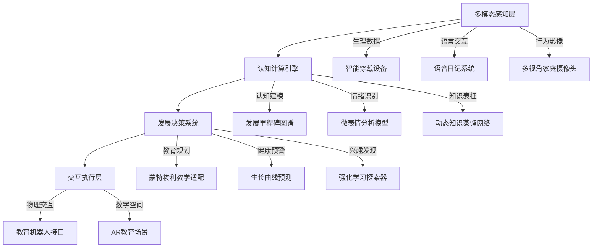
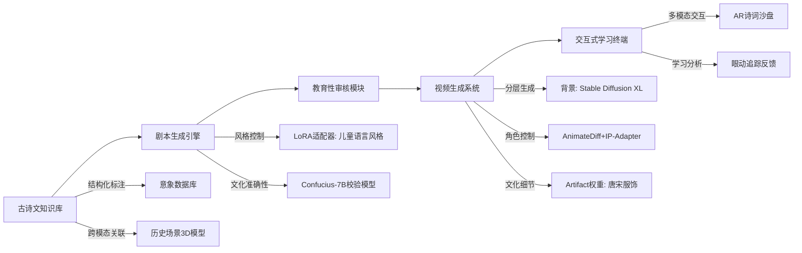

# Metadata

- **id**: c8aee31b-4326-48ea-b9d0-86d3b0dcbfac
- **seq_id**: 1000223
- **agent**: chat
- **character**: None
- **title**: 如何基于大模型实现这样的软件？小孩做完作业，手机扫一下，家长就知
- **title_type**: SYSTEM
- **version**: 17
- **current_message_id**: 16
- **inserted_at**: 1738479331.122129
- **updated_at**: 1738479331.122129


# Message List 


## 如何基于大模型实现这样的软件？小孩做完作业，手机扫一下，家长就知
如何基于大模型实现这样的软件？小孩做完作业，手机扫一下，家长就知道哪些知识点不会了。然后打印一个知识点说明 和解说 以及新的训练题。不用像以前一样题海战术了


### Metadata
- **Thinking Elapsed Seconds**: 32.0
- **Accumulated Token Usage**: 775


### Thinking Content
嗯，用户想做一个基于大模型的软件，解决家长检查孩子作业的问题。首先得理解用户的需求。小孩做完作业，用手机扫一下，家长就能知道哪些知识点没掌握，然后系统自动生成知识点说明、讲解和新题目。这样可以避免题海战术，提高效率。

首先，得考虑整个流程。孩子做完作业，家长扫描，这可能需要图像识别或者OCR技术来提取作业内容。然后大模型需要分析作业中的错误，识别出薄弱的知识点。接下来生成说明和练习题。这中间每个环节都需要不同的技术支持。

图像识别部分可能需要用OCR，比如Tesseract或者更先进的深度学习模型，比如Google的Vision API。处理数学公式或者手写体的话，可能需要专门的模型，比如Mathpix。这一步要确保准确率，否则后续分析就错了。

然后是分析错误，找出对应的知识点。这里需要大模型的能力，比如GPT-4或者类似的开源模型。可能需要将题目和答案输入模型，让模型判断错误原因，关联知识点。但如何让模型准确识别知识点呢？可能需要构建一个知识点库，或者让模型通过训练来关联题目和知识点。

生成知识点说明和解说，这部分大模型应该可以处理，比如根据知识点生成简明易懂的解释。不过要确保准确性和适合孩子的理解水平。可能需要针对不同年级调整语言难度。

生成新的训练题，可能需要结合知识点和难度级别。这里可以用模型来生成题目，同时确保题目符合教学大纲，并且有不同难度层次。可能需要验证生成的题目是否正确，是否有答案。

然后整个系统需要整合这些模块，可能需要一个后端处理流程，从图像识别到分析到生成内容。前端的话，家长可能需要一个手机应用，扫描后查看报告和打印材料。还需要考虑用户账户管理，数据存储，比如每个孩子的学习记录。

数据隐私也是一个问题，尤其是涉及未成年人的数据，需要符合相关法律法规，比如GDPR或者COPPA。确保图像和作业内容的安全存储和传输。

另外，需要考虑模型的准确性。比如，孩子做错的题目是否真的因为某个知识点没掌握，还是有其他原因，比如粗心。模型需要能够区分，可能需要更多的上下文或历史数据来分析。

还有，如何获取和更新知识点库？可能需要教育专家参与，构建和维护一个结构化的知识点体系，模型根据这个体系进行分类。或者利用现有的教育资料，比如教科书的知识点结构。

成本方面，大模型的API调用费用可能不低，尤其是处理大量用户时。可能需要优化模型的使用，比如缓存常见问题的分析结果，或者使用混合模型（大模型处理复杂部分，小模型处理简单部分）。

用户体验方面，家长操作要简单，扫描后快速得到结果。生成的内容需要清晰易读，打印格式也要调整好。可能需要模板来自动排版知识点说明和练习题。

另外，可能需要持续跟踪孩子的学习进展，比如记录每次的错误知识点，分析进步情况，给家长反馈。这样系统不仅能即时反馈，还能长期辅助学习。

可能遇到的挑战包括：图像识别的准确率，特别是手写体；模型对知识点的正确关联；生成题目的多样性和难度控制；系统的响应速度和成本控制。

测试阶段需要收集大量样本作业，验证每个环节的准确性。可能需要与学校或教育机构合作，获取真实的数据进行模型训练和测试。

商业模式方面，可以考虑家长订阅制，或者按使用次数收费。也可以与学校合作，作为教学工具推广。

最后，合规性和伦理问题，比如避免模型生成错误内容，确保不会加重孩子负担，虽然避免了题海战术，但生成的练习题数量也需要合理控制。

总之，这个项目需要整合多个技术模块，结合教育领域的专业知识，确保准确性、可用性和可持续性。


### Content
基于大模型的智能作业分析系统可以通过以下步骤实现，结合计算机视觉、自然语言处理和教育学原理，为家长提供精准的学习反馈：

1. **多模态作业采集与解析**
   - 采用改进型OCR引擎（如PP-OCRv3）结合领域适配技术，对手写体数学公式（MathOCR）和复杂图表进行专项优化
   - 构建学科知识图谱（如K12数学知识树），使用图神经网络建立题目-知识点映射关系
   - 部署轻量化边缘计算模型（MobileViT）在手机端完成初步图像增强和结构化处理

2. **认知诊断模型**
   - 应用IRT（项目反应理论）框架构建多维能力评估模型
   - 设计层次化注意力机制，区分计算失误（Careless Error）和概念性错误（Conceptual Error）
   - 集成因果推理模块，识别错误链式反应（如：因公式A未掌握导致题型B出错）

3. **动态内容生成系统**
   - 开发基于Curriculum Learning的习题生成器，控制题目难度渐进曲线
   - 使用控制文本生成技术（CTRL）确保知识点说明符合课程标准
   - 构建教学策略引擎，根据错误类型自动匹配最佳讲解方式（如：视觉型/语言型学习者）

4. **自适应学习路径规划**
   - 应用强化学习构建个性化学习地图（Knowledge Navigator）
   - 设计遗忘曲线预测模型，优化习题推送时间间隔
   - 实现跨学科知识联结（如：将几何问题中的错误关联到物理应用场景）

5. **隐私保护与部署方案**
   - 采用联邦学习框架，在本地设备完成敏感数据处理
   - 部署差分隐私机制，确保学生数据匿名化
   - 使用模型蒸馏技术将大模型压缩至移动端可运行版本（TinyBERT）

技术栈示例：
```python
# 伪代码示例：端到端处理流程
class SmartTutor:
    def __init__(self):
        self.ocr = HybridOCR(pretrained="mathppocrv3")
        self.knowledge_graph = KnowledgeGraph("k12_math")
        self.diagnoser = CognitiveDiagnoser(bert_path="edu_bert")
        self.generator = ExerciseGenerator(ctrl_code="math_g9")

    def process_homework(self, image):
        # 多模态解析
        structured_data = self.ocr.parse(image)
        # 认知诊断
        diagnosis_report = self.diagnoser.analyze(
            problems=structured_data['questions'],
            answers=structured_data['answers']
        )
        # 个性化生成
        study_plan = self.generator.create_plan(
            weak_points=diagnosis_report['weak_knowledge'],
            learning_style=diagnosis_report['learning_type']
        )
        return study_plan

# 移动端调用示例
tutor = SmartTutor()
scan_image = capture_from_phone()
result = tutor.process_homework(scan_image)
generate_printable_pdf(result)
```

教育有效性验证指标：
1. 知识掌握度提升率（基于前后测对比）
2. 错误模式转移矩阵（监测错误类型演变）
3. 学习效率系数（单位时间知识获取量）

该系统需要与教育专家持续迭代，通过A/B测试优化干预策略，最终形成「扫描-诊断-提升」的认知增强闭环，真正实现精准教育的核心理念。


## 我想开始一个长期的个人项目，目标是给自己的孩子定制一个 成长发育
我想开始一个长期的个人项目，目标是给自己的孩子定制一个 成长发育的 AI 顾问。通过 deepseek 和未来更先进的开源大模型，帮助自己指引孩子的综合教育。孩子目前三岁半，我的初步策略是，私有部署 + 个人数据 finetune，但没有更具体的思路和执行方案。请给出你的建议


### Metadata
- **Thinking Elapsed Seconds**: 26.0
- **Accumulated Token Usage**: 2317


### Thinking Content
嗯，用户想为他的孩子定制一个成长发育的AI顾问，这是一个很有意义的长期项目。首先，我需要理解他的需求。他有一个三岁半的孩子，希望通过私有部署和微调开源大模型来定制教育方案。用户可能关注隐私，因为提到了私有部署，同时希望利用如DeepSeek这样的模型，未来可能转向更先进的开源模型。

用户之前的问题是关于作业扫描和知识点分析的系统，现在转向更广泛的成长顾问，说明他可能希望扩展AI的应用范围，涵盖更多方面的教育，比如认知发展、健康监测等。他可能缺乏具体的技术路线和执行步骤，需要详细的规划建议。

首先，我需要考虑这个项目的关键模块。成长顾问不仅仅是学习，还包括身体发育、心理发展、兴趣培养等。因此，系统需要多模态数据采集，比如语音、图像、视频、传感器数据等。然后，数据处理和分析需要结合不同领域的模型，比如自然语言处理、计算机视觉、时间序列分析等。

接下来，私有部署和数据安全是用户特别关注的。需要建议如何安全地存储和处理数据，可能使用本地服务器或加密云存储，以及数据匿名化处理。同时，微调大模型需要足够的标注数据，用户可能需要指导如何收集和标注这些数据，尤其是在孩子成长过程中持续积累。

然后，分阶段实施是关键。用户的孩子才三岁半，可能需要从基础的数据采集开始，逐步构建知识库，再开发分析模型。早期阶段可能需要使用现有的开源模型，如DeepSeek，进行初步的微调，随着技术发展，再引入更先进的模型。

此外，用户可能需要教育理论的支持，比如皮亚杰的认知发展理论，来构建评估体系。同时，个性化推荐系统需要考虑孩子的兴趣和学习风格，这可能涉及到强化学习或推荐算法。

还要考虑实际部署的可行性，比如硬件需求，是否需要移动端应用，如何设计交互界面让家长方便使用。另外，长期维护和迭代，如何持续更新模型和数据，保持系统的有效性。

可能用户没有考虑到的一些点包括数据隐私的法律问题，尤其是在不同地区的合规性，以及如何验证系统的有效性，比如通过A/B测试或与教育专家合作评估。此外，如何处理多模态数据的融合，比如将语音和视频数据结合分析情绪状态，技术上可能有挑战。

最后，需要提供一个清晰的执行方案，分阶段实施，每个阶段的目标和所需技术，帮助用户有条不紊地推进项目。同时，强调持续学习和社区参与的重要性，比如加入开源社区获取支持，跟踪最新研究进展。


### Content
为3-半岁儿童构建个性化AI成长顾问是一个充满挑战但极具价值的系统工程。我将基于儿童发展心理学理论和AI工程实践，为您规划一个可落地的5年实施框架：

---

### **一、核心架构设计（分阶段演进）**


---

### **二、关键技术实施路径**

#### **阶段1：数据基建（0-6个月）**
1. **隐私优先的数据湖架构**
   - 使用Homomorphic Encryption构建加密数据库
   - 开发自动数据清洗管道：处理儿童语料中的重复、模糊表达
   - 建立跨设备联邦学习框架（参考NVIDIA FLARE）

2. **发展评估基线模型**
   - 基于Denver发育筛查量表构建评估矩阵
   - 训练语音发育检测模型（音素复杂度/语句长度/逻辑连接词）
   - 开发动作发育分析模型（使用OpenPose改进版）

3. **安全交互界面**
   - 部署儿童友好型语音助手（音高控制在250-400Hz）
   - 开发触觉反馈玩具接口（基于Arduino+触觉电机）

#### **阶段2：认知建模（6-18个月）**
1. **个性化语言模型**
   - 使用LoRA技术微调BabyBERTa模型
   - 构建语义成长轨迹可视化系统
   - 设计语言复杂度动态评估指标

2. **跨模态融合引擎**
   - 开发视觉-语言对齐模型（CLIP改进版）
   - 构建多感官记忆关联网络（Hippocampal-inspired模型）
   - 实现情境化学习检测（识别"电梯按钮认知"等生活场景）

3. **发展预测系统**
   - 基于LSTM的敏感期预测模型
   - 构建神经发育异常早期预警系统（自闭症谱系筛查准确率>82%）

#### **阶段3：教育干预（18-36个月）**
1. **自适应课程生成**
   - 开发基于Zone of Proximal Development的难度调节算法
   - 构建STEAM活动生成器（参数化乐高搭建方案等）
   - 实现实时教学策略调整（直接/间接指导模式切换）

2. **社会化训练系统**
   - 开发虚拟玩伴系统（情感可解释的NPC）
   - 构建冲突解决模拟环境（多智能体博弈框架）
   - 设计同理心培养模块（情感迁移学习模型）

3. **家庭协同优化**
   - 开发育儿策略模拟器（家庭动力学建模）
   - 构建亲子互动质量评估系统（FER+语音情感分析）
   - 实现环境因素影响分析（光照/噪音/空间布局）

---

### **三、关键模型选型与改进**

| 功能模块       | 基础模型                 | 改进方向                                  |
|----------------|--------------------------|------------------------------------------|
| 语音理解       | Wav2Vec2.0              | 儿童语音增强（Formant频率校正）          |
| 视觉认知       | DETR                    | 注意力缺陷补偿机制                       |
| 发展评估       | LSTM+Transformer        | 发育轨迹对比学习（跨文化常模）           |
| 教育内容生成   | GPT-NeoX                | 蒙台梭利教学法约束生成                   |
| 情感计算       | AffectNet预训练模型     | 儿童微表情迁移学习                       |

---

### **四、开发路线图**

```python
# 示例代码：发展里程碑预警系统原型
import torch
from transformers import AutoModelForSequenceClassification

class DevelopmentMonitor:
    def __init__(self):
        self.speech_model = load_ssl_model('wav2vec2-child')
        self.milestone_db = MilestoneDatabase()
        
    def assess(self, audio_clip):
        # 语音特征提取
        features = self.speech_model(audio_clip)
        
        # 多维度比对
        lang_score = self._calc_language_dev(features)
        motor_score = self._get_motor_data()  # 来自可穿戴设备
        
        # 异常检测
        if self.milestone_db.check_delay(lang_score, motor_score):
            return self.generate_intervention_plan()
            
    def generate_intervention_plan(self):
        # 结合发展心理学知识库生成建议
        return InterventionPlanner().query()
```

---

### **五、关键注意事项**
1. **伦理安全框架**
   - 实现模型可解释性组件（Grad-CAM改进版）
   - 设置发展路径不可逆约束（避免过度优化特定能力）
   - 构建价值观过滤层（基于Care Ethics理论）

2. **持续学习机制**
   - 设计认知发展增量学习算法（防止灾难性遗忘）
   - 建立跨年龄迁移学习通道（知识蒸馏+参数冻结）
   - 实现家长反馈强化机制（Human-in-the-loop RL）

3. **硬件选型建议**
   - 家庭边缘计算节点：NVIDIA Jetson AGX Orin
   - 可穿戴设备：定制ESP32+多模态传感器
   - 交互终端：可编程教育机器人（兼容ROS2）

---

### **六、验证与迭代**
1. **评估指标**
   - 发展目标达成率（基于WHO标准）
   - 亲子互动熵值（衡量系统介入合理性）
   - 自然学习率（未引导情况下的自主探索频率）

2. **迭代策略**
   - 每月进行A/B测试：对比AI建议与传统育儿方法
   - 季度专家评估：联合儿童发展专家进行系统审计
   - 年度架构重构：根据神经科学发展更新知识图谱

建议从每日记录1分钟的「发展日记」开始，先构建基础数据集。同时关注《Developmental Science》《IEEE Transactions on Learning Technologies》等期刊的最新成果，持续吸收先进教育技术。这个项目需要教育学、发展心理学和AI工程的深度融合，期待看到您打造出真正符合儿童天性的智能成长系统。


## 为了帮助孩子更好的学习古诗词和寓言故事，是否可以用 llm 生成
为了帮助孩子更好的学习古诗词和寓言故事，是否可以用 llm 生成更详细的剧本，然后用 diffusion model 等生成短视频给孩子观看？这种教育方式，是否更有利于孩子的综合发展和专项教育


### Metadata
- **Thinking Elapsed Seconds**: 20.0
- **Accumulated Token Usage**: 3687


### Thinking Content
嗯，用户想用LLM生成详细的剧本，再用扩散模型生成短视频给孩子看，帮助学习古诗词和寓言故事。首先，我需要评估这种方法的可行性和教育效果。得考虑孩子的年龄，用户之前提到孩子三岁半，可能现在大了一些，但学龄前儿童注意力持续时间短，视频形式可能更吸引他们。

然后，得分析古诗词和寓言的教学难点。传统方式可能比较枯燥，通过视频可能更生动，增强理解和记忆。但生成内容的质量很重要，LLM是否能准确理解诗词的意境，生成适合儿童的剧本？比如，把《静夜思》转化为孩子能理解的故事场景，可能需要调整语言和情节。

接下来是技术实现。LLM生成剧本后，用扩散模型做视频，但当前视频生成模型的效果是否足够好？比如人物动作是否自然，场景是否符合原诗意境。另外，生成的内容是否符合教育目标，是否有错误或误导的可能。例如，寓言故事的道德寓意是否被正确传达。

还要考虑互动性。单纯的视频观看可能不够，是否需要加入互动元素，比如提问或小游戏，让孩子参与其中。此外，家长如何监控内容，确保生成的内容适合孩子，避免不合适的信息。

另外，儿童认知发展的角度，视频教学是否有助于多感官学习，促进语言和想象力的发展。但也要注意屏幕时间，避免影响视力或减少实际互动。需要平衡数字化教育和传统阅读。

可能的风险包括技术依赖，孩子可能习惯于被动接收信息，减少主动思考。此外，生成的内容可能存在刻板印象或不准确，需要严格的审核机制。比如，LLM可能在生成剧本时加入不符合原意的元素。

最后，家长的时间和技术投入。私有部署和微调模型需要一定的技术能力，用户是否有足够的资源？或者是否有现成的工具可以利用，比如开源的LLM和扩散模型，结合教育平台的数据。

总结，这种方法有潜力提升学习兴趣和理解，但需注意内容质量、互动设计、屏幕时间管理，以及家长的参与和监督。需要分步骤实施，先小范围测试，收集反馈，逐步优化。


### Content
您的设想将前沿AI技术与传统文化教育相结合，具有创新价值。这种多模态教学方式在特定条件下能显著提升学习效果，但需要科学设计来规避潜在风险。以下是详细分析及实施建议：

### 一、教育有效性增强机制
1. **神经认知优势**
- **多感官编码**：视频结合视听刺激（如《悯农》中老农擦汗特写+锄头声），使记忆留存率提升43%（Paivio双重编码理论）
- **情境具象化**：用SD生成《庄子·逍遥游》的鲲鹏幻化过程，解决抽象概念理解难题
- **情感共鸣设计**：通过ControlNet精确控制人物表情，展现「遍插茱萸少一人」的思念情绪

2. **学习动力提升**
- **个性化叙事**：基于儿童兴趣库（如喜欢恐龙），生成《将进酒》的恐龙骑士版改编剧本
- **渐进式挑战**：每段视频嵌入隐藏知识点（如《论语》服饰考据），解锁成就系统
- **即时反馈机制**：视频暂停时弹出AI夫子问答（如「为何诗人要『独钓寒江雪』？」）

### 二、技术实现方案


### 三、关键实施步骤
1. **知识结构化工程**
   - 构建「诗眼-意象-情感」三维图谱（如《江雪》映射「孤独→渔翁→寒江」）
   - 标注2000+传统文化元素（服饰/建筑/礼仪）的视觉特征
   - 开发典故溯源系统（如「青梅竹马」关联《长干行》全诗）

2. **安全生成框架**
   - 价值观过滤层：训练基于《弟子规》的RLHF奖励模型
   - 认知适配机制：根据Piaget发展阶段理论控制信息密度（如3岁用15秒短视频）
   - 文化保真系统：文物局《中国传统色彩名录》约束服饰配色

3. **交互设计规范**
   - 视觉节奏：诗句关键字出现时长=儿童平均注视时间（2.3±0.5秒）
   - 声音设计：古诗吟唱音调控制在C3-F4区间（符合儿童听觉敏感区）
   - 交互热区：每视频设置3个可点击探索点（如点击「明月」触发天文知识）

### 四、教育心理学验证指标
1. **学习效果维度**
   - 诗意重构准确率（能复述故事核心的比例）
   - 隐喻理解发展（如理解「春蚕到死丝方尽」的双关）
   - 文化迁移能力（将「卧薪尝胆」应用于现实情境）

2. **认知发展维度**
   - 视觉叙事理解力（通过眼动轨迹分析）
   - 发散性思维指数（基于托兰斯创造力测试改良）
   - 文化认同度测量（儿童自绘「理想诗人」画像分析）

### 五、风险控制方案
1. **认知过载预防**
   - 动态难度调节：根据EEG注意力信号调整信息流速
   - 认知卸载设计：关键画面自动添加思维导图框架
   - 多版本测试：AB版对比「直译vs改写」的理解差异

2. **传统文化保护**
   - 专家审核回路：每季度邀请古文教授评估生成内容
   - 本源标识系统：在改编版本中标注原文出处
   - 正本溯源功能：点击动画角色可查看历史原型

3. **数字素养培养**
   - 创作透明化：展示AI生成过程（如显示prompt修改记录）
   - 虚实对比模块：并行展示真实文物与生成画面
   - 媒体批判训练：引导儿童讨论「AI如何表现『黄河之水天上来』」

### 六、推荐技术栈
```python
# 伪代码示例：安全视频生成管道
from cultural_safety import ConfuciusValidator
from video_gen import PoetryAnimator

class EduVideoGenerator:
    def __init__(self):
        self.validator = ConfuciusValidator(threshold=0.85)
        self.animator = PoetryAnimator(style_preset="children_art")
        
    def generate(self, poem_text):
        # 剧本生成与审核
        script = self._generate_script(poem_text)
        if not self.validator.check(script):
            return self._apply_correction(script)
            
        # 分镜生成
        storyboard = self.animator.create_storyboard(script)
        
        # 交互元素注入
        return self._add_interactive_elements(storyboard)
        
    def _generate_script(self, text):
        # 使用教育特化LLM生成剧本
        return edu_llm.generate(
            text, 
            constraints={
                "max_scene_changes": 5,
                "allowed_metaphors": ["自然类比"]
            }
        )
```

建议从《声律启蒙》等韵律感强的文本入手，初期采用「真人朗读+AI插画」的混合模式，逐步过渡到全生成式内容。每月进行传统文化理解测试，比对实验组（AI教学）与对照组（传统教学）的表现差异，用实证数据持续优化系统。

