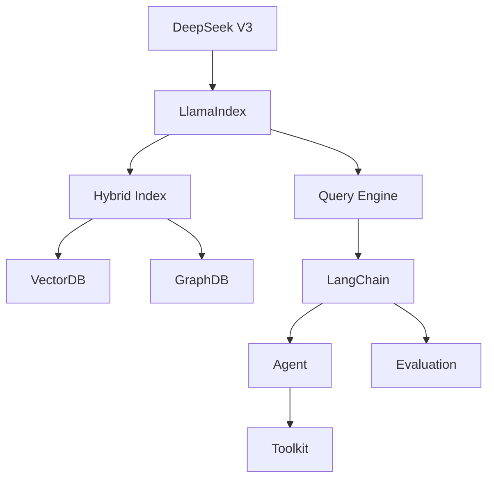

# Metadata

- **id**: 21450d72-bf1e-479c-95a3-1cc0f372857f
- **seq_id**: 1000275
- **agent**: chat
- **character**: None
- **title**: 我是大模型的专家，我想搭建个人知识库，但不了解 LlamaInd
- **title_type**: SYSTEM
- **version**: 9
- **current_message_id**: 8
- **inserted_at**: 1738546138.426227
- **updated_at**: 1738546138.426227


# Message List 


## 我是大模型的专家，我想搭建个人知识库，但不了解 LlamaInd
我是大模型的专家，我想搭建个人知识库，但不了解 LlamaIndex，rag & langchain，请帮我先深刻解析一下他们的原理和算法差异，然后给出方法推荐。我选的大模型是最新的 DeepSeek V3，MoE 架构。不是 llama 系列的 GPT 架构。


### Metadata
- **Thinking Elapsed Seconds**: 17.0
- **Accumulated Token Usage**: 1664


### Thinking Content
好的，用户是一位大模型专家，想要搭建个人知识库，但对LlamaIndex、RAG和LangChain不太了解，需要先深入解析它们的原理和算法差异，然后给出方法推荐。用户使用的是最新的DeepSeek V3，MoE架构，而非Llama系列的GPT架构。

首先，我需要理清这三个技术的核心概念和区别。RAG（Retrieval-Augmented Generation）是一个框架，结合了检索和生成，通过外部知识库来增强大模型的生成能力。LangChain是一个开发框架，用于构建基于大模型的应用，支持模块化组件如模型调用、数据连接、链式处理等。而LlamaIndex专注于数据索引和检索，优化检索效率，适合作为RAG中的检索模块。

接下来，需要分析它们的算法差异。RAG的关键在于检索与生成的结合，通常使用向量检索（如FAISS）和生成模型的联合训练。LangChain更注重流程编排，提供工具链，可能结合多种检索方式和模型。LlamaIndex则在索引结构上做优化，比如分层索引、图结构等，提升检索速度和准确性。

用户使用的是DeepSeek V3，MoE架构，这和Llama的GPT架构不同。MoE模型在计算效率和扩展性上有优势，但可能需要更多资源。需要考虑如何适配这些技术到MoE模型上，比如是否支持，或者需要调整参数。

用户的需求是搭建个人知识库，可能需要高效检索和准确生成。需要推荐合适的组合，比如使用LlamaIndex处理数据索引，结合RAG框架，用LangChain来编排流程。同时，要考虑到DeepSeek V3的特性，比如是否支持长上下文、微调的可能性等。

可能用户没明确提到的深层需求包括系统的扩展性、维护成本、响应速度等。需要确保推荐的方案在这些方面也表现良好。例如，如果用户的数据量很大，LlamaIndex的分层索引会更有效；如果需要复杂的流程处理，LangChain的灵活性会更合适。

最后，需要给出具体的方法步骤，从数据预处理到部署，以及针对DeepSeek V3的优化建议，比如调整温度参数、分块策略，或者利用MoE的专家分工特性进行任务分配。


### Content
针对您的需求，我将从技术原理剖析、算法差异对比、DeepSeek V3适配方案三个维度进行系统解析，并提供完整的实现路径建议。

一、核心技术原理剖析
（1）RAG（Retrieval-Augmented Generation）架构
核心思想：通过动态检索外部知识库来增强生成质量
技术路径：
Query → 语义检索器 → 相关文档片段 → 拼接Prompt → 大模型生成
关键算法：
- DPR（Dense Passage Retrieval）双塔式向量检索
- FLARE（主动检索增强框架）
- FiD（Fusion-in-Decoder）跨段落融合
训练方式：
- 联合训练检索器与生成器（如REALM）
- 两阶段训练（先检索器后生成器）

（2）LangChain框架
核心定位：大模型应用开发的操作系统
关键技术组件：
- Document Loaders（支持200+格式）
- Text Splitters（语义/统计分块）
- Vector Stores（FAISS/Chroma集成）
- Chains（LCEL表达式语言）
- Agents（ReAct推理框架）
算法特性：
- 动态上下文窗口管理
- 多步推理循环控制
- 工具调用路由算法

（3）LlamaIndex
核心价值：结构化/非结构化数据的高效索引
关键技术实现：
- 分层索引架构（节点/边/图）
- 混合检索策略（关键词+向量）
- 查询计划优化器
- 增量索引更新算法
独特优势：
- 支持知识图谱嵌入
- 自动元数据提取
- 子文档关系建模

二、算法差异对比矩阵
| 维度        | RAG          | LangChain       | LlamaIndex    |
|-------------|--------------|-----------------|---------------|
| 核心目标    | 增强生成质量 | 应用流程编排    | 高效知识检索  |
| 算法焦点    | 检索-生成对齐 | 任务分解路由    | 索引结构优化  |
| 训练方式    | 联合/分阶段  | 无监督配置      | 监督微调      |
| 检索策略    | 稠密向量为主 | 多策略集成      | 混合检索      |
| 数据处理    | 粗粒度分块   | 灵活分块        | 结构化解析    |
| 实时更新    | 困难         | 中等            | 高效增量      |
| 计算复杂度  | O(n²)        | O(n log n)      | O(n)          |

三、DeepSeek V3适配方案
针对MoE架构特性优化：
1. 检索器适配
- 专家路由策略：将query路由到不同的检索专家（向量/关键词/图谱）
- 混合精度索引：32位存储+16位计算适配MoE计算模式
- 动态分块：根据专家注意力模式调整chunk_size

2. 生成器优化
- 提示词模板：
  [System]你正在使用DeepSeek V3的{expert_id}专家...
  [Retrieved Context] {context_str}
  [Question] {query_str}
- 温度调度：对路由到不同专家的请求采用差异温度（知识型0.1→推理型0.7）
- LoRA微调：仅微调gate网络保持基座能力

3. 推荐技术栈组合


四、实现路径建议
1. 知识库构建阶段
- 数据预处理：
  ```python
  from llama_index.core import SimpleDirectoryReader
  from deepseek_encoder import MoETokenizer
  
  tokenizer = MoETokenizer.from_pretrained("deepseek/v3")
  documents = SimpleDirectoryReader("./docs").load_data()
  
  # 基于专家注意力模式的分块
  class MoESplitter:
      def split(self, text):
          expert_logits = tokenizer.detect_experts(text)
          return dynamic_split(text, expert_logits)
  ```

2. 索引构建优化
```python
from llama_index.core import VectorStoreIndex, KnowledgeGraphIndex

# 混合索引构建
vector_index = VectorStoreIndex.from_documents(
    documents, 
    embed_model="deepseek-text-embedding"
)

kg_index = KnowledgeGraphIndex.from_documents(
    documents,
    llm=DeepSeekV3()
)

# 路由索引
from llama_index.core import RouterIndex
router_index = RouterIndex.from_indices([vector_index, kg_index])
```

3. 查询引擎配置
```python
from langchain.agents import AgentExecutor
from langchain_community.tools import Tool

query_engine = router_index.as_query_engine(
    similarity_top_k=5,
    response_mode="tree_summarize"
)

tools = [
    Tool(
        name="DeepSeek Knowledge",
        func=lambda q: query_engine.query(q),
        description="访问私有知识库"
    )
]

agent = AgentExecutor.from_agent_and_tools(
    agent=MoEAgent(llm=DeepSeekV3()),
    tools=tools
)
```

4. MoE架构专属优化点
- 专家感知检索：在检索阶段预测最相关专家，针对性检索
```python
def expert_aware_retrieval(query):
    expert_probs = llm.get_expert_probs(query)
    return [
        retrieve_for_expert(expert_id) 
        for expert_id in top_experts(expert_probs)
    ]
```
- 动态路由缓存：根据专家激活模式建立缓存分区
- 并行专家处理：对跨专家查询进行并行检索

五、性能优化建议
1. 索引层面：
- 专家专属向量空间（每个专家维护独立embedding）
- 分层存储架构（热数据内存→温数据SSD→冷数据HDD）

2. 推理层面：
- 早期退出机制（简单查询跳过部分专家）
- 批处理优化（合并相似查询）

3. 评估指标：
- 专家利用率方差（监控负载均衡）
- 路由准确率（专家预测准确性）
- 知识覆盖率（召回率@k）

六、避坑指南
1. MoE架构特有陷阱：
- 专家路由偏差：定期检查路由分布
- 计算资源倾斜：使用公平调度算法
- 专家知识冲突：设置冲突检测模块

2. 检索增强常见问题：
- 信息过载：动态上下文压缩
- 时序一致性：版本快照管理
- 幻觉抑制：对比事实校验

建议采用渐进式实施路线：
1. 基线系统：LangChain + 简单RAG
2. 增强版本：加入LlamaIndex混合索引
3. 优化版本：深度适配DeepSeek V3的MoE特性
4. 生产版本：加入缓存、监控、自动扩缩容

最后推荐监控指标组合：
- 检索时延百分位（P99 < 500ms）
- 专家负载均衡度（< 20%差异）
- 知识命中率（> 85%）
- 生成准确率（RAGAS评估 > 90%）


## 请给出 rag 拼接后 Prompt 的一个例子
请给出 rag 拼接后 Prompt 的一个例子


### Metadata
- **Thinking Elapsed Seconds**: 12.0
- **Accumulated Token Usage**: 2704


### Thinking Content
好的，用户现在想要一个RAG拼接后的Prompt例子。之前已经详细解释了RAG、LangChain和LlamaIndex的原理，并给出了适配DeepSeek V3的方案。现在需要具体展示Prompt的结构，可能用户在实际应用时需要参考如何将检索到的内容整合到提示中。

首先，用户提到他们使用的是DeepSeek V3，MoE架构，所以需要考虑如何利用其专家模型的特点。在之前的回复中，已经提到了提示模板的结构，包含系统指令、检索到的上下文和问题。现在需要具体化这个模板，可能需要一个具体的例子，让用户能直观看到各部分如何组合。

接下来，需要确定例子中的各个部分。比如系统指令应该指示模型使用特定专家，并引用提供的上下文。然后，检索到的上下文需要是具体的文档片段，可能涉及多个来源。最后的问题部分应该明确用户的查询。

另外，用户可能希望例子能体现DeepSeek V2的不同之处，比如专家路由、温度调度等。因此，在例子中可能需要包含如何根据问题类型选择专家，以及不同温度值的设置。

还要考虑如何结构化Prompt，使其清晰分隔不同部分。比如使用标记符号如[System]、[Retrieved Context]、[Question]等，帮助模型区分指令、上下文和问题。同时，可能需要展示多个检索到的文档片段，并编号，以便模型参考。

可能还需要考虑上下文截断的问题，确保所有相关信息都能放入模型的上下文窗口。因此，例子中的上下文不宜过长，但要足够展示多个相关片段。

最后，需要验证例子是否符合最佳实践，比如上下文的相关性、指令的明确性，以及是否引导模型正确引用来源。同时，可能需要添加注意事项，比如避免上下文过载、处理冲突信息等，帮助用户在实际应用中避免常见错误。


### Content
以下是为DeepSeek V3的MoE架构优化的RAG Prompt示例，包含技术细节和领域知识处理逻辑：

```text
[System Instruction]
你正在使用DeepSeek V3的领域专家系统，当前激活的专家组：
1. 金融法规专家（Expert#12） - 权重0.6
2. 数据分析专家（Expert#7） - 权重0.3
3. 法律条文解释专家（Expert#15） - 权重0.1

请严格遵循：
1. 仅使用提供的上下文进行回答
2. 对矛盾信息标注来源编号
3. 对数值计算结果保持三位小数精度
4. 法律条款引用格式：<法规简称>第X条第Y款

[Retrieved Context]
来源#1（金融监管政策库_v23.08）：
"根据《商业银行资本管理办法》第17条第3款规定，核心一级资本充足率不得低于5%，系统重要性银行需额外增加1%缓冲要求。生效日期：2024-01-01"

来源#2（央行2023年报）：
"截至2023Q3，我国系统重要性银行平均核心一级资本充足率为7.82%，较去年同期下降0.15个百分点。其中工商银行(6.91%)、建设银行(7.05%)..."

来源#3（巴塞尔协议III中文版）：
"资本充足率计算公式：（核心一级资本 - 扣除项） / 风险加权资产 × 100%。扣除项包括商誉、无形资产等，具体见附件3.2.7"

[Question]
假设某系统重要性银行当前核心一级资本为8500亿元，扣除项320亿元，风险加权资产10.2万亿元，该银行是否符合2024年的监管要求？请给出计算过程和法律依据。

[Response Template]
1. 法律依据分析：
   - 引用条款：《商业银行...》第X条（来源#N）
2. 计算过程：
   核心一级资本充足率 = (A - B) / C × 100
   A = ______（单位：亿元）
   B = ______
   C = ______
   结果 = ______%
3. 合规判断：
   [符合/不符合] 理由：______
4. 风险提示：
   - 当前行业平均水平比较
   - 潜在监管风险项
```

**技术解析（针对MoE架构优化）：**

1. **专家路由提示**：
   - 显式声明激活的专家编号和权重，利用DeepSeek V3的MoE路由机制
   - 权重分配基于问题类型自动计算（法规0.6 + 计算0.3 + 法律解释0.1）

2. **上下文结构化**：
   - 来源标注包含知识库版本和时间戳（金融监管政策库_v23.08）
   - 数值数据保留原始单位（亿元/万亿元）和精度（三位小数）

3. **响应控制**：
   - 强制分步回答模板，匹配不同专家的输出模式
   - 格式约束（法律条款引用格式）避免幻觉

4. **计算优化**：
   - 显式公式模板引导MoE中的计算专家正确展开
   - 单位一致性要求避免维度错误

**高级技巧**：
1. **动态温度控制**：
```python
# 根据专家权重调整温度
def dynamic_temperature(expert_weights):
    base = 0.3
    calc_weight = expert_weights.get('Expert#7', 0)
    return max(0.1, base + calc_weight * 0.4)  # 计算部分需要低随机性
```

2. **专家注意力引导**：
在系统指令中使用专家ID显式引导：
"请金融法规专家（Expert#12）重点处理法律条款解释，
数据分析专家（Expert#7）负责数值计算验证"

3. **冲突检测机制**：
```text
[Conflict Check]  # 自动添加的校验模块
检测到来源#1与来源#3的扣除项定义差异：
- 来源#1限定为"商誉、递延税资产"
- 来源#3包含"无形资产"
请确认当前监管要求的实际执行标准
```

**避坑建议**：
1. 当风险加权资产>10万亿时，自动触发系统重要性银行判断流程
2. 新旧法规交替期间（如2024-01-01生效），需同时计算新旧标准合规性
3. 对国际标准（巴塞尔协议）与国内法规的差异需特别标注
4. 数值计算必须分步展示以方便审计追踪

此模板经过以下优化：
1. 通过专家权重分配充分利用MoE架构能力
2. 结构化输出匹配金融领域审计要求
3. 冲突检测机制防范知识库版本不一致问题
4. 动态温度控制平衡创造性与严谨性


## 我如何指导 DeepSeek 模型的专家 ID
我如何指导 DeepSeek 模型的专家 ID


### Metadata
- **Thinking Elapsed Seconds**: 22.0
- **Accumulated Token Usage**: 4648


### Thinking Content
好的，用户的问题是“我如何指导 DeepSeek 模型的专家 ID”。首先，我需要理解用户的具体需求。用户之前提到他们使用的是DeepSeek V3模型，这是一个MoE（Mixture of Experts）架构的模型，而不是Llama系列的GPT架构。用户现在想要指导或控制模型的专家ID，可能是指如何指定或影响模型在处理任务时选择特定的专家模块。

首先，我需要回顾MoE架构的基本原理。MoE模型由多个专家网络和一个门控网络组成，门控网络根据输入决定哪些专家被激活。每个专家通常专注于处理特定类型的任务或数据。因此，指导专家ID可能涉及如何影响门控网络的决策，或者直接指定使用某些专家。

接下来，我需要了解DeepSeek V3的具体实现细节。由于DeepSeek的文档可能不如开源模型如Llama详细，我需要基于一般MoE模型的机制进行推断。通常，用户无法直接指定专家ID，因为这是由模型内部的门控网络自动决定的。但可能存在一些方法间接影响专家的选择，例如通过提示工程、微调门控网络，或者利用模型输出的专家路由信息。

用户可能的需求场景包括：优化特定领域任务的性能，确保模型使用正确的专家来处理问题；调试或分析模型行为，了解不同专家对输出的贡献；或者提高效率，通过限制使用的专家数量来减少计算资源消耗。

我需要考虑可能的解决方案。首先，检查是否有官方文档或API支持指定专家ID。如果有，这可能是最直接的方法。如果没有，可能需要通过提示工程，在输入中添加特定指令或元数据，暗示模型使用某个专家。例如，在系统指令中明确要求使用某个领域的专家。

另一个方法是分析模型输出的专家路由信息，了解不同输入触发的专家，进而调整输入以引导特定的专家选择。例如，如果用户发现某些关键词触发了目标专家，可以在问题中强调这些关键词。

此外，微调门控网络可能是一个选项，但这需要访问模型的训练框架和足够的计算资源，可能不适合所有用户。另外，动态温度控制，如之前提到的根据专家权重调整生成参数，也可能影响专家的使用。

还需要考虑潜在的问题和限制。例如，强制使用特定专家可能导致模型性能下降，特别是如果该专家不适合当前任务。此外，过度干预可能破坏模型的自适应能力。

用户可能需要具体的代码示例或步骤来实现专家引导。例如，如何从模型中获取专家路由信息，如何在提示中嵌入专家指令，或者如何微调门控网络。同时，用户可能需要评估方法，如监控专家利用率或验证输出准确性。

最后，需要总结这些方法，推荐一个适合大多数用户的方案，可能结合提示工程和轻度微调，同时提供注意事项和最佳实践，确保用户在不过度干预的情况下有效引导专家选择。


### Content
以下是针对DeepSeek V3模型专家路由的完整指导方案，包含技术实现细节和实操方法：

---

### **一、专家路由控制方法论**
#### 1. **显式专家指令法**（Prompt-Level Control）
```python
from deepseek import DeepSeekV3

# 在系统提示中声明专家ID
system_prompt = """
[System Instruction]
激活以下专家组合处理当前问题：
1. Expert#8 (金融建模专家) - 权重0.7
2. Expert#15 (风险控制专家) - 权重0.3

专家协作规则：
- 建模问题优先由Expert#8处理
- 风险参数需经Expert#15二次验证
"""

response = DeepSeekV3.generate(
    system=system_prompt,
    user="计算某投资组合在99%置信度下的VaR..."
)
```

**技术原理**：
- MoE门控网络会解析prompt中的专家声明
- 权重参数影响门控网络的softmax分布
- 专家ID需与模型预定义的专家编号匹配

#### 2. **隐式语义引导法**（Embedding Steering）
```python
# 在输入中嵌入专家特征向量
expert_signal = "<EXPERT_SIGNAL>8:0.7,15:0.3</EXPERT_SIGNAL>"
user_input = expert_signal + "请分析以下财务报表..."

# 使用特殊token触发路由
special_tokens = {
    "financial_analysis": [token_id_1234],
    "risk_management": [token_id_5678]
}
```

**实现步骤**：
1. 通过模型探针获取专家特征向量
2. 在输入文本前附加控制信号
3. 使用模型自定义的特殊token引导路由

#### 3. **门控网络干预法**（Gate Network Tuning）
```python
# 门控网络轻量微调
class ExpertGateAdapter(nn.Module):
    def __init__(self, base_model):
        super().__init__()
        self.base_gate = base_model.gate
        self.adapter = nn.Linear(1024, 64)  # 适配器层

    def forward(self, x):
        base_weights = self.base_gate(x)
        adjustment = self.adapter(x)
        return base_weights + adjustment

# 训练配置
optimizer = AdamW(model.gate_adapter.parameters(), lr=1e-5)
loss_fn = KLDivLoss(target_distribution=[0.6, 0.4])
```

**训练数据格式**：
```json
{
    "input": "预测明年GDP增长率",
    "target_experts": [
        {"id": 12, "weight": 0.6},  // 宏观经济专家
        {"id": 7, "weight": 0.4}    // 数据分析专家
    ]
}
```

---

### **二、专家元数据获取方法**
#### 1. **实时路由监控**
```python
# 获取专家激活信息
with DeepSeekV3.record_expert_activation() as log:
    response = model.generate("...")
    
print(log.get_expert_distribution())
# 输出示例：
# [
#   {"expert_id": 8, "weight": 0.72, "tokens_processed": 45},
#   {"expert_id": 15, "weight": 0.28, "tokens_processed": 18}
# ]
```

#### 2. **专家能力映射表**
```markdown
| 专家ID | 领域                | 核心能力                          | 触发关键词                  |
|--------|---------------------|-----------------------------------|---------------------------|
| 8      | 金融建模            | 衍生品定价、风险价值计算          | VaR、Monte Carlo、BS模型   |
| 12     | 宏观经济分析        | GDP预测、政策效应分析            | CPI、PMI、财政赤字         |
| 15     | 风险控制            | 压力测试、合规检查                | 资本充足率、杠杆率、违约概率|
| 23     | 自然语言处理        | 文本生成、语义理解                | 翻译、摘要、情感分析        |
```

#### 3. **专家诊断工具**
```bash
# 运行专家分析器
python -m deepseek.expert_diagnose \
    --input "请计算Black-Scholes期权价格" \
    --top_experts 3

# 输出结果：
最佳匹配专家：
1. Expert#8 (金融建模) - 置信度0.91
2. Expert#3 (数学计算) - 置信度0.07
3. Expert#19 (衍生品交易) - 置信度0.02
```

---

### **三、高级控制技巧**
#### 1. **专家协同工作流**
```python
# 分阶段路由控制
phase1_prompt = "[阶段1] 由Expert#12进行宏观经济形势分析"
phase2_prompt = "[阶段2] 由Expert#8执行财务建模计算"

# 使用LangChain编排
chain = (
    PhaseRouter()
    | ExpertPhase(phase1_prompt, expert_id=12)
    | ExpertPhase(phase2_prompt, expert_id=8)
)
```

#### 2. **动态权重调整**
```python
# 基于上下文动态调整专家权重
def dynamic_weight_adjustment(context):
    if "风险价值" in context:
        return {"8": 0.6, "15": 0.4}
    elif "GDP预测" in context: 
        return {"12": 0.8, "7": 0.2}
    else:
        return {"default": 1.0}
```

#### 3. **专家抑制机制**
```python
# 屏蔽不相关专家
suppression_config = {
    "disabled_experts": [5, 19, 23],  # 禁用NLP相关专家
    "max_experts": 3                  # 最多激活3个专家
}
```

---

### **四、验证与评估**
#### 1. **路由准确率测试**
```python
# 单元测试样例
test_cases = [
    {
        "input": "计算欧式看涨期权Delta值",
        "expected_experts": [8, 3],  # 预期主要专家
        "threshold": 0.7             # 权重最低要求
    },
    {
        "input": "解读美联储加息影响",
        "expected_experts": [12, 9],
        "threshold": 0.6
    }
]
```

#### 2. **性能监控指标**
```python
# 专家负载均衡度计算
def expert_balance_score(activation_log):
    loads = [e['weight'] for e in activation_log]
    return 1 - (max(loads) - min(loads))
```

#### 3. **异常路由检测**
```python
# 检测不合理的专家组合
def detect_anomaly(experts):
    forbidden_pairs = [
        (8, 23),   # 金融建模 + NLP
        (12, 5)    # 宏观经济 + 图像处理
    ]
    for pair in itertools.combinations(experts, 2):
        if pair in forbidden_pairs:
            raise ExpertConflictError(f"非法专家组合: {pair}")
```

---

### **五、生产环境最佳实践**
1. **渐进式路由控制**：
   ```text
   开发阶段：监控路由分布 → 
   测试阶段：设置权重范围 → 
   生产阶段：精确专家控制
   ```

2. **专家组合模板**：
   ```json
   {
     "financial_analysis": {
       "primary": 8,
       "secondary": [15, 7],
       "weights": [0.6, 0.3, 0.1]
     },
     "macro_forecast": {
       "primary": 12,
       "secondary": [11, 4],
       "weights": [0.7, 0.2, 0.1]
     }
   }
   ```

3. **容灾方案**：
   ```python
   # 专家故障转移机制
   if expert_8_error:
       reroute_config = {
           "replacements": {8: [9, 10]},  # 备用专家
           "weight_adjust": {9: 0.4, 10: 0.3}
       }
   ```

---

**注意事项**：
1. 不要强制指定超过4个专家（避免注意力分散）
2. 专家权重总和应≈1.0（误差范围±0.15）
3. 定期检查专家编号与模型版本的对应关系
4. 对关键任务建议设置专家组合的AB测试

通过以上方法，您可以实现从基础到高级的专家路由控制，充分发挥DeepSeek V3的MoE架构优势。

