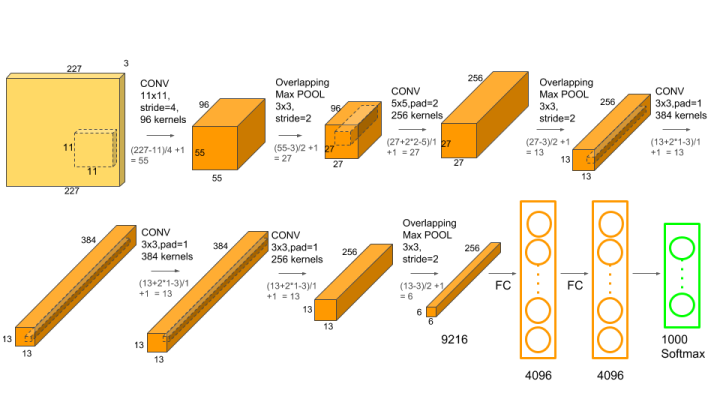
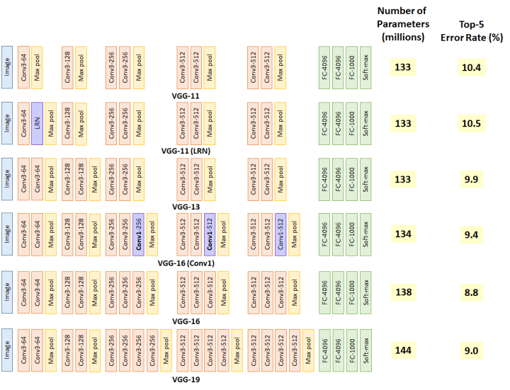

# [Paper Reading]经典 CNN model -- 从 AlexNet 到 ResNet

## 目的

以史为鉴。

重读经典论文，了解 CNN 思想的演进历史，理解重要理论突破的时代背景。

重点是围绕 3 组 4 个模型展开：

- AlexNet
- VggNet v.s. GoogleNet
- ResNet

选择这几个模型原因：

- Image classification 研究方向的代表性工作。
- 看完就能干活，落地到实际项目中产生业务价值。
- object detection 的常用 backend，属于 CV 领域的基础理论，入门必学。
- 没有覆盖 MobileNets 等轻量模型、NAS 搜索和图网络等新模型结构，不是一套玩法。

注意事项：

1. 早期论文，正确与错误理论齐飞，不适合纯新手入门 CNN。学完基础理论再读这些经典文章加深理解，是不错的。
2. 硬件性能相关的优化，可直接跳过。10 年来，硬件发生了巨大的变化，优化理论差别很大。很多方法都不适用了，比如：3G 显存限制，用加法换乘法。

一点感想：

1. 明显的感受到 LeCun 和 Hinton 对早期工作的指引作用。
2. 数据集的规模和硬件算力，是 CNN 理论进步的 2 大基石。 

## 模型的 Tensorflow 实现

代码仓库：https://github.com/JackonYang/hands-on-deep-learning-using-tensorflow-2.0

Jupyter 文件：

- 01-AlexNet-on-MNIST-and-Cifar10-dataset.ipynb
- 02-VggNet.ipynb
- 03-ResNet.ipynb

Paper List(需要爬墙)

Google Sheets: [[PaperReading] CNN models from-AlexNet-to-ResNet](https://docs.google.com/spreadsheets/d/1J3PrLkx1lVa-Kdvp9Yg9jBZeB7HFz5QWD1fRU19uW0k/edit#gid=0)

## 经典模型介绍

#### AlexNet -- 深度学习复兴的奠基工作

- paper：https://papers.nips.cc/paper/4824-imagenet-classification-with-deep-convolutional-neural-networks.pdf

这项工作的本质是：算力不足、理论不清晰的情况下，如何从巨大的搜索空间里“幸运“的找到更好的 CNN 网络结构。

作者自己写了 N 条有意义的工作。但从 2020 年回看，关键还是以下 2 项工作：

1. 挖掘出 ReLU 的加速效果，比 tanh 激活函数快 6 倍。
2. 从单 GPU 到 多 GPU 训练的尝试，证明了效果 & 方法。借鉴了 Ciresan 2011 的工作。

网络结构：5 Convolutional Layers，3 Fully Connected Layers.

从数据看人肉搜索的难度：

1. 从 LeNet5（1998） 到 AlexNet（2012） 用了 14 年。
2. AlexNet 的 top5 错误率，2010 年到 2012 年，从 17.0% 降到 15.3%，进展非常小。 

研究效率低的 3 个因素：

1. cuda 代码太难写了。
2. 硬件算力弱。2 张 GTX580，要训练 5-6 天。
3. 理论不清晰，正确与错误的观点齐飞。

作者的几个观点，体现当时的认知：

1. CNN 的 connection 和 parameter 更少，理论上的正确率要低于全连接网络。

    现在回看，基于 Hebbian principal 和 sparse matrix 等工作，在复杂的深度模型中，这个理论判断，不 work。ResNet 成功，也否定了参数越多越好的观点。

2. 使用了 LRN（local response normalization），2 年后，VggNet 文章认为 LRN 没用。
3. 使用了 overlapping pooling，很小的 trick，也没有很好的理论支撑。

其他一些散碎 notes：

1. 卷积核很大（11*11），overfitting 严重。
2. 如何避免 overfitting 也是这个时期模型必须讨论的，但都是小 trick，有的还是错的。
3. 在数据增强上，花了很大的工作量，对应的，又影响了怎么做 inference，然后又引入了一堆适配工作量。当算力 & 数据量提升以后，这些工作的价值都很弱了。

#### VggNet -- 暴力加深收官之作

- paper：https://arxiv.org/abs/1409.1556

单 Net 是 ImageNet 2014 第一，但是 Google 用 7 Nets 搞出了比单 net 略好的效果。

AlexNet 之后，大家逐渐认识到，网络越深越好。这篇文章提出的 3*3 卷积核，成为经典，至今依旧广泛使用。

用到了 1x1 卷积，没有用于降维。只是线性组合，对模型的帮助，个人感觉不大。

- 网络深度：16-19 layers
- 训练时间：4 张 Titan Black, 训练 2-3 周。

VggNet 模型结构与 ImageNet error rate 如下

__VggNet 模型结构__

可以从理论上推导出，堆叠 3*3，等价于使用大卷积核，但计算量会更少，非线性能力更强。
由此引入的模型深度增加，是否导致了训练难度增加？作者没有讨论。个人观点，在 Batch Norm 等理论提出以后，训练难度的增加，应该可以忽略。

使用 3*3 小卷积核的历史：

1. Ciresan 2011，关注点是 GPU 加速，而非模型结构。
2. GoogLeNet 2014，各种卷积核都用了，偏 NAS 的让模型自己选。不能体现对 3*3 卷积核的价值有深刻认识。
3. Goodfellow 2014，street number detection。侧重在 object detection 上的应用，对 CNN 基础理论的改进，讨论的少。鉴于同年 Google 同事的 GoogleNet 也没有讨论 3*3，我们认为，这篇文章也没有意识到 3*3 卷积核的地位。

__VggNet 训练方法__

遵循了 LeNet5 & AlexNet 的方法（没有创新）

370k 次迭代，74 个 epoch。

用 pre-train 解决 weight initialization 难题。

浅层模型，随机初始化。然后逐步增加深度，并用上一次的结果做初始化。

论文提交后，发现 Glorot & Bengio 2010 年的 random initialisation procedure 已经解决了这个问题。大神绕的这个弯路，弧度有点大。:D

__2 个思考题__

1. 为什么花了 2 年才搞定 -- 不能更短？
2. 为什么只花了 2 年 -- 比别人快在哪里？

为什么 2014 年才收官

从 ImageNet 2013 的 best submission 进行分析

1. Visualizing and Understanding Convolutional Networks https://arxiv.org/abs/1311.2901
2. OverFeat: Integrated Recognition, Localization and Detection using Convolutional Networks https://arxiv.org/abs/1312.6229
3. SermanetSome Improvements on Deep Convolutional Neural Network Based Image Classification https://arxiv.org/abs/1312.5402

这 3 篇文章，都用了大量的时间理解模型、探索优化方向。如何用数据增广来降低 overfitting，占据了每篇论文的一个章节。以及，还在讨论 multi-scale 的图片怎么处理。

Szegedy 在 2014 年给的总结，也可以看出大家都还处于懵逼中刚看到曙光的水平。

For larger datasets such as Imagenet, the recent trend has been to increase the number of layers(NIN, lin) and layer size(ZFNet, Sermanet 2014), while using dropout(Hinton 2012) to address the problem of overfitting.

#### Google Inception v1-- 有远见的论文

论文写得好，模型做的太复杂，使用价值很低。

Google 的 infra，尤其是 DistBelief 起到了大力出奇迹的作用。只有 Google 能做出这种模型。大概也只有 Google 会用这种模型。

关注 efficiency，设计模型的原则之一是，计算量控制在 1.5B multiply-adds at inference time。

相比于理解 inception 模型结构，更建议认真读一下 Motivation and high level considerations 一节。非常有远见，大都是现在的研究热点。

简要讨论了以下内容：

- 稀疏矩阵
- 矩阵乘法优化
- 网络自动搜索 -- NAS 网络
- 定制化硬件 -- AI 芯片

#### ResNet -- 弹性加深，提升算法性能的终点

shortcut connection 的思想是核心，论文的讲解、公式推导比大多数人的翻译更清晰。

分 v1，v2 两个版本。

- ResNet v1: https://arxiv.org/abs/1512.03385
- ResNet v2: https://arxiv.org/abs/1603.05027

ResNet 的性能和能效比，都好于 VggNet。碾压式的进步。

ResNet 之后，优化模型的正确率已无太大意义。

新的更有意义的命题是：在模型正确率损失不大的情况下，如何用更弱的硬件完成模型推理。比较典型的代表是 MobileNet，量化。

## 总结

1. AlexNet，VggNet，ResNet 是 3 个典型的实用模型，需要复现出 SOTA 水平。
2. 通用 CNN 模型用于 image classification，已经很成熟。1) 可以放心的使用，2) 很难有新的研究突破。
3. 有标注的数据规模、标注质量，是决定落地效果的关键因素。learning with noise label, semi-supervised learning, unsupervised learning 等方向，研究价值较大。